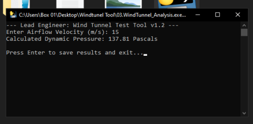
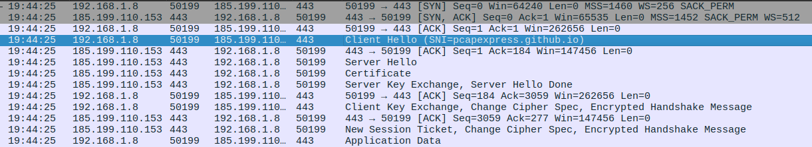
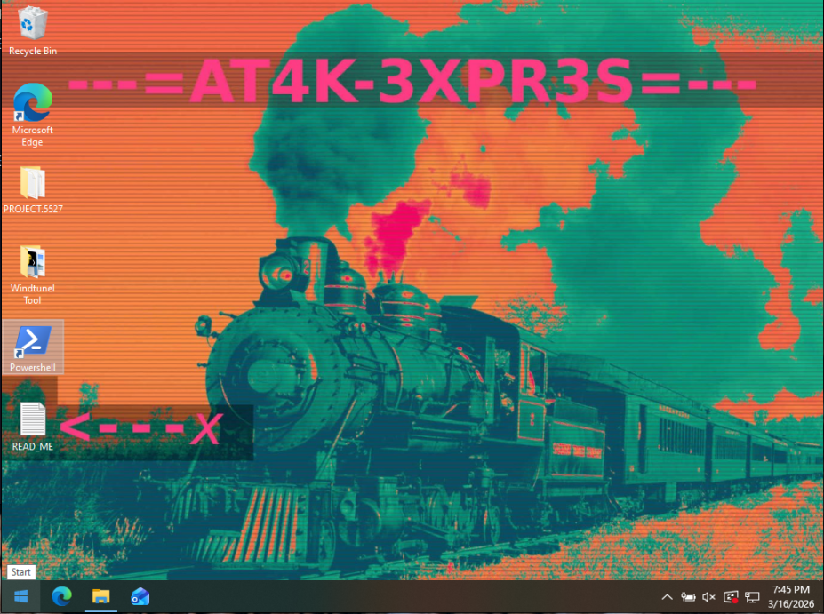
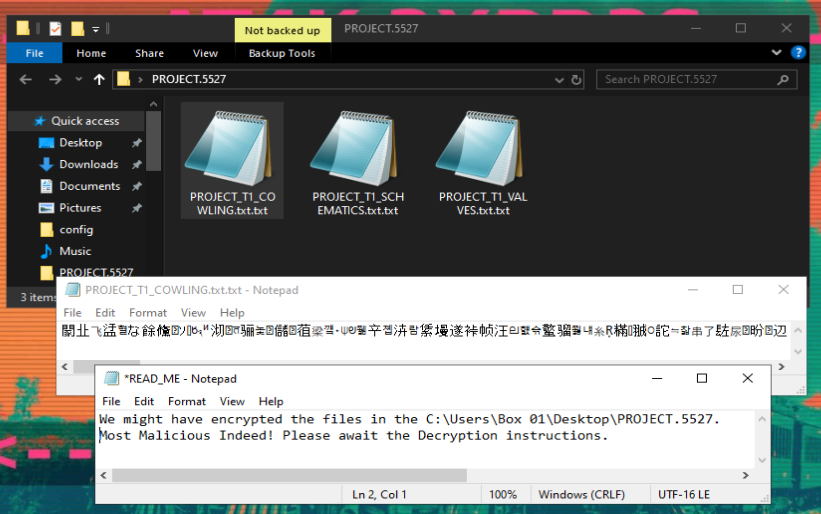
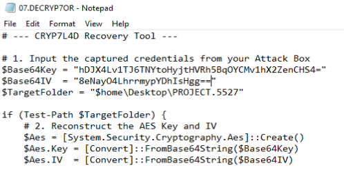
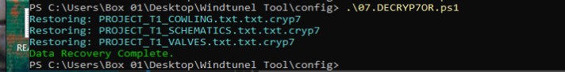
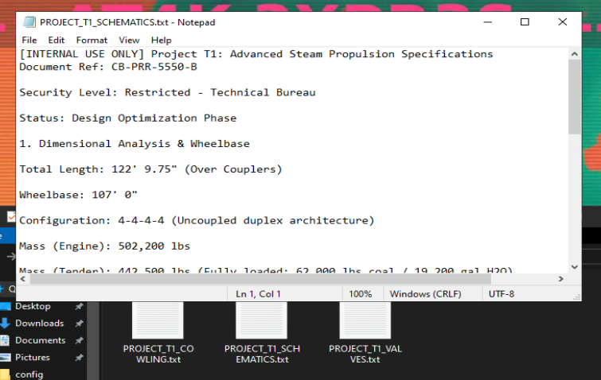

# MALWARE-BOILER
## THE W4LLPEPP3R
### Stage Three:

Final script designed to alert the user and point out the READ_ME on the desktop via a wallpaper change, the Powershell script is compiled in to an .exe file using python, upon execution the file actually presents a legitimate math script that the user can interact with, and the in the background a GET request is made to the portfolio page to grab the PNG image and place it immediately on to the desktop. 

## 01.EXECUTING .EXE

<small>“10.Windtunel-tool-exe.png”<small>

Here we have the final element, when interacting with the compiled .exe file the user opens a legitimate applet helping calculate the wind drag coefficient. The .exe hides a Powershell script that upon producing the terminal window runs a few commands in the background. It reaches out to the "dropper" website and grabs a wallpaper. Upon downloading the wallpaper is forced on to the desktop. The bright colors and an arrow should attract the users eyes to the newly created text document making sure it will be read.

### THE SAMPLE

<pre data-label="W4LLPEPP3R" style="--delay: 0s;"><code>
<strong># ---‹‹‹ 03.W4LLPEPP3R ›››---</strong>
<strong># 01. --< DOWNLOAD PATH >--</strong>
$url = "https://pcapexpress.github.io/assets/boiler/W4LLPEPP3R.png"
$localPath = "$env:TEMP\bg_update.jpg"

<strong># 02. --< IMAGE DOWNLOAD >--</strong>
Invoke-WebRequest -Uri $url -OutFile $localPath

<strong># 03. --< PREPARE REGISTRY >--</strong>
$code = @'
using System.Runtime.InteropServices;
public class Wallpaper {
    [DllImport("user32.dll", CharSet = CharSet.Auto)]
    public static extern int SystemParametersInfo(int uAction, int uParam, string lpvParam, int fuWinIni);
}
'@
Add-Type -TypeDefinition $code

<strong># 04. --< SET WALLPAPER >--</strong>
# 0x0014 is the SPI_SETDESKWALLPAPER action
...
<strong>--< CUTTING THE CODE >--</strong>
</code></pre>

    
## 02.WIRESHARK HTTPS TRAFFIC

<small>“11.Wireshark-https-traffic.png”<small>

This time we have very little evidence to go on, however we can see that the connection on **port:** 443 is directed towards the pcapexpress.github.io website. 

## 03.WALLPAPER SET

<small>“13.Wallpaper.png”<small>

Here we have a jarring wallpaper appearing on the workstations desktop, 
and we see the READ_ME.txt file marked with a handsome arrow. 

## 04.DATA AND NOTE

<small>“14.Encrypted-data.png”<small>

We can clearly see that the contents of our files has been scrambled. 
And a note insinuating that some new instructions are coming. 

## 05.SRIPT AND KEYS

<small>“15.Adding-keys.png”<small>

Since this is a friendly Purple Team Exercise, the TECH-BUREAU admin receives a decryption script 
along with the necessary keys. 

## 06.RUNNING THE DECRYPTOR

<small>“16.Decryption-script.png”<small>

We are successful at regaining the data.

## 07.DATA RECOVERED

<small>“17.Decryption-proof.png”<small>

Looks like the TECH-BUREAU is back in buiseness. 
Exercise compleat!

#### ‹‹‹MALWARE-BOILER SHUTTING DOWN››› 

Thank you. Good bye.

  
  ⦿
  

[4.3]

