# PCAPEXPRESS Wireshark Series
## Exercise 01: Download from fake software site
### Briefing:
**Platform:** malware-traffic-analysis[.]net 
**Pcap File:** 2025-01-22-traffic-analysis-exercise.pcap 
  As a SOC analyst, we are contacted to investigate a pcap file of a confirmed infection. 
A staff member most likely downloaded a file from a malicious page after searching for Google's Authenticator. 
We must investigate and write the key findings in a short report. 
In the mean time the IT department will handle wiping the affected machine. 

### TASK:
<pre data-label="TASK" style="--delay: 0s;"><code>
01.Discover host details - [x] 02.Investigate breach - [x] 03.Write consise report - [x]
</code></pre>
### Tools:
<pre data-label="TASK" style="--delay: 0.7s;"><code>
<strong>* Wireshark</strong> – pcap inspection         <strong>* VirusTotal</strong> – malicious IPs and File inspection
<strong>* CyberChef</strong> – decoding packet data    <strong>* md5sum</strong> – calculating file hashes
</code></pre>

## 00: Prologue

  This is my first exercise in the series. The goal is to showcase my thinking 
in a (hopefully) simple to follow investigation complemented by images. 
The outcome of the investigation will be checked with the answers provided. 
I’m trying to showcase my skills at the time of writing. 
Still much to learn, however, no better time to start than now. 
***Let the Upward Mobility commence***!<be>

## 01: HOST DISCOVERY

  Our first job is to gather details on the victim machine. We can filter for DHCP traffic.
Heres a good way to filter or that: dhcp.option.type == 12, 
we are interested in the DHCP Request packet details.

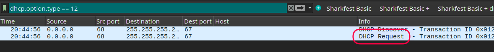

<small>“02.DHCP request.png”<small>

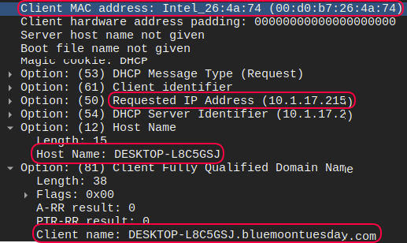

<small>“03.DHCP details.png”<small>

  This gives us most of the necessary Host details but one more piece of information can be gathered. 
We can use the **Kerberos** protocol traffic to check if a user name is available, 
for this we filter for kerberos and search if we get any data in the **CNameString** field.

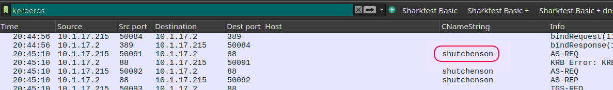

<small>“04.Kerberos.png”<small>

Here are the results of our host enumiration:

**IP Address:** 10.1.17.215 
**MAC address:** Intel_26:4a:74 (00:d0:b7:26:4a:74) 
**Host Name:** DESKTOP-L8C5GSJ 
**Client name:** DESKTOP-L8C5GSJ.bluemoontuesday.com 
**User Name:** shutchenson 

## 02: EXAMINING TRAFFIC

  A great way to start would be to check the HTTP and HTTPS traffic minusing the SSDP (Simple Service Discovery Protocol) for noise reduction. 
We filter for (http.request or tls.handshake.type == 1) and !(ssdp) 
We want to see the GET requests first to check for malicious downloads. Which we locate almost immediately. 
We shall take a look at the downloaded files later. But we see the suspicious domains. 

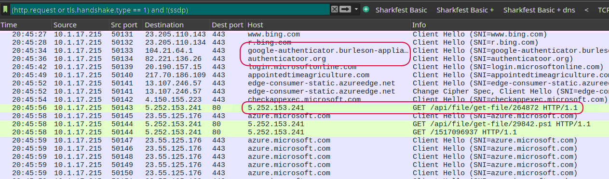

<small>“05.Fake domain + GET.png”<small>

The suspects are:

**No.01:** google-authenticator[.]burleson-appliance[.]net 
**No.02:** authenticatoor[.]org 
**No.03:** 5[.]252[.]153[.]241 

  All three are marked as malicious by VirusTotal. The first 2 are posing as a legitimate authentication website/app. 
When examining the 3d suspect IP we check the Communicating Files section in the Relations tab of VirusTotal 
and we find that it is known for the 29842.ps1 file. 
We discover that file name in the TCP stream of the first GET request from our malicious IP. 

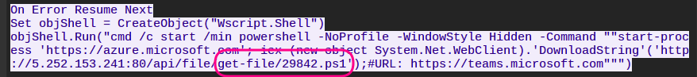

<small>“06.First GET TCP stream.png”<small>

  The first step appears to be executing a shell script that calls for the malicious file in question to be downloaded. 
We shall take a look at the TCP stream of the second GET request.

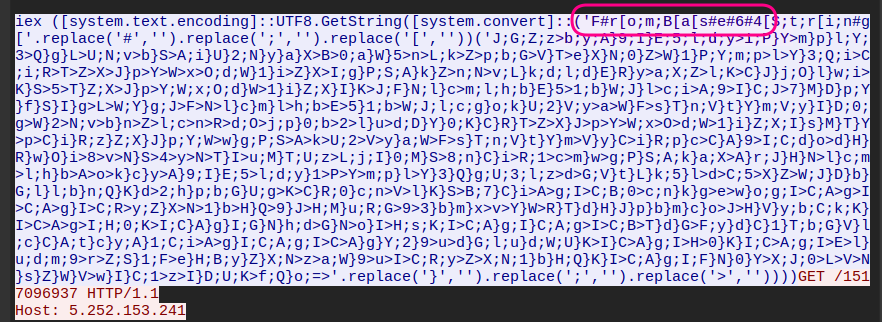

<small>“07.Second GET TCP stream.png”<small>

  We see an obfuscated and encrypted payload. The following string is an indicator of just that: 
('F#r[o;m;B[a[s#e#6#4[S;t;r[i;n#g['.replace('#','').replace(';','').replace('[','') 
The encryption is Base64 and there are characters that can be removed in order to decrypt the payload. So we use CyberChef. 

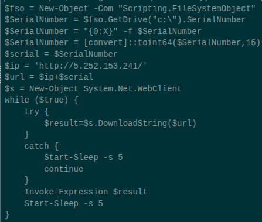

<small>“08.CyberChef decrypted.png”<small>

  I would like to come back later to the payload results to get a better understanding of how the malware is unraveling here. But from my untrained eye it seams like some form of system enumeration with adding a serial number to the particular machine to then sent the data to the Control and Command server. And the attempts to reach out are programmed with 5 second intervals.

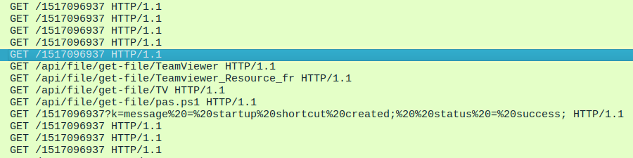

<small>“09.GET sequence.png”<small>

  The GET requests are 5 seconds apart. I have checked the TCP stream of the above sequence. The **GET** requests return a “*HTTP/1.1 404 Not Found*” until one request gets an “*HTTP/1.1 200 OK*”. This in turn rolls out a series of commands, to establish our main payload TV.dll and as I would understand to try and hide it among legitimate software, TeamViewer.exe. The VirusTotal information will be provided below.

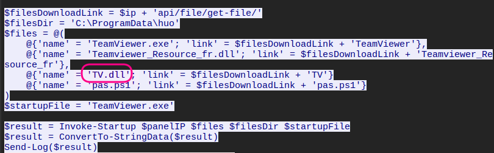

<small>“10.Main Payload Download.png ”<small>

  I have checked the pas.ps1 file as well and it is identical to the 29842.ps1 we have looked in to before, same obfuscation and base64 string. 
We also see that after the file download sequence we see a URL message which will decode in to: 
 
GET /1517096937?k=message = startup shortcut created;  status = success 
 
Perhaps communicating to the C2 server that the payload is deployed successfully. 
 

  There is one more discovery that I have initially missed and had to go back to after checking for the exercise answers. There are 2 other C2 servers. They are easy to miss. They appear a few times in the pcap capture. If we filter out the 5.252.153.241 IP we can quickly identify the 2 new IP addresses.

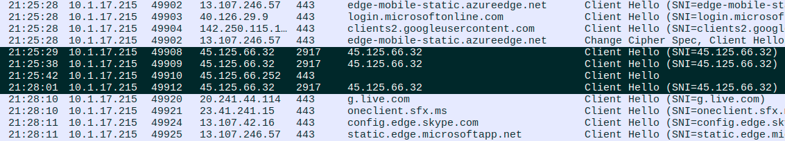

<small>“11.Filtering Out IP.png ”<small>

Another way is just scrolling through the GET traffic of our “main” malicious IP address we will see the following.

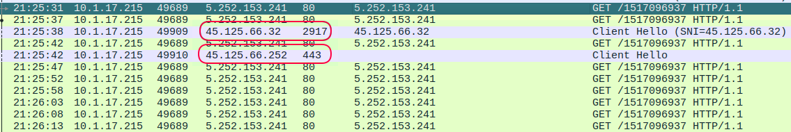

<small>“12.C2 Ips.png”<small>

These are the only other IPs without a host name so they do stick out. We of course check them out with VirusTotal, they both show up as malicious and associated with malware. I tried checking the TCP stream of the port 2917 packet but its just showing encrypted traffic, with the 443 ones expectedly so.
The verdict here would be that the Command and Control servers are the mentioned above IPs and the likely communication ports for them are 443 and 2917.

**C2 servers:** 45[.]125[.]66[.]32 and 45[.]125[.]66[.]252

## 03: Examining Objects

  We have determined the files of interest. 
Using the Object Export function I have gathered the files and ran a md5sum 
to generate each files hash and than checked each one using VirusTotal. 
Here are the results: 

<pre data-label="OBJECTS"><code>
01.File Name: 29842.ps1                          02.File Name: pas.ps1
MD5 Hash: ce075aee9430f3a8f2809356f4deca8e       MD5 Hash: 10febc686b7035ba0731c85e8e474bcd
VirusTotal Result: Malicious                     VirusTotal Result: Malicious
Poplar threat label: trojan.powershell/obfuse    Poplar threat label: trojan.powershell/malgent
BitDefender: Trojan.Generic.38977079             BitDefender: rojan.Generic.38018337
  
03.File Name: TeamViewer.exe                         04.File Name: Teamviewer_Resource_fr.dll
MD5 Hash: 9dfa2bd6bddc746acea981da411d59d3       MD5 Hash: 35fa2ce449deb8b93b8ba73bf35e5e7b
VirusTotal Result: No Threat Detected            VirusTotal Result: No Threat Detected

05.File Name: TV.dll
MD5 Hash: 66af1c986968e3bf2a35791e8b55581f
VirusTotal Result: Malicious
Poplar threat label: trojan.doina/malgent
BitDefender: Gen:Variant.Doina.88562
</code></pre>

## 05. Short Report and Conclusion

We have established that a company employee (host:DESKTOP-L8C5GSJ) has clicked on a link taking them to a fake domain (google-authenticator[.]burleson-appliance[.]net) posing to be a legitimate authentication service provider. 

The employee proceeded downloading and executing a file that started a chain reaction of downloading a sequence of files and deploying malware on their machine.

The malware in question is (TV.dll) and it is disguised to trick users to believe it is a piece of legitimate TeamViewer software. The network traffic indicates that some form of persistence has been established and that the infected host is communicating with the adversary using 2 IPs (45.125.66.32 and 45.125.66.252).

The briefing states that the IT department has wiped the affected machine and there is no immediate threat to the organization.

The next procedure would be to update the banned IP addresses and add the Malware hashes to the EDR/Antivirus solution data bank.

  *This is the first pcap investigation sorted for the pcapexpress series. 
However it was not my first attempt at this particular exercise, it took some time to get my bearings, 
the project was abandoned twice at this point. But sometimes stubbornness is a virtue. 
I feel quite comfortable navigating WireShark and I must say I’m digging the processes of pcap investigation. 
Much to learn, much to do. Jolly good, moving on!*

#### NEXT STOP?

This will conclude the first exercise in the series. See you in the next one! 
[PCAP-EXPRESS:02 "Nemotodes" ](./PCAP-EXPRESS-02.md) 
*Virus over fake software update.* 

  
  ⦿
  

[2.1]

