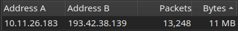

# PCAPEXPRESS Wireshark Series
## Exercise 02: Nemotodes

#### Briefing:
We are a SOC analyst for a medical research facility. Alerts on traffic in your network indicate someone has been infected.
Two alert log files have been provided to help correlate the events. Analyze and report.

TASK:
    • Write an incident report based on malicious network activity from the pcap and from the alerts.
    • The incident report should contains 3 sections:
    • Executive Summary: State in simple, direct terms what happened (when, who, what).
    • Victim Details: Details of the victim (hostname, IP address, MAC address, Windows user account name).
    • Indicators of Compromise (IOCs): IP addresses, domains and URLs associated with the activity.  SHA256 hashes if any malware binaries can be extracted from the pcap.

Tools:

Wireshark – pcap inspection
VirusTotal – checking for malicious IPs and Files
CyberChef – decoding malicious traffic
md5sum – calculating file hashes
sha256sum – calculating file hashes

## 00: Prologue

This exercise is giving us some useful pointers regarding the infection. As 2 log files are given I shall be referencing them below to compare the findings.

## 01: Host Discovery

Starting of with our standard discovery techniques. 
First I check the DHCP with the ”dhcp.option.type == 12” filter. There's no DHCP traffic. 
Moving on to NETBIOS. Filtering for “nbns.flags.opcode == 5”.

.png)

<small>‘02a.Netbios.png’</small>

We get some Registration Data. We can examine the packet details to get some Host details.

.png)

<small>‘02b.Packet Details.png’</small>

Than we check Kerberos

.png)

<small>‘03.Kerberos.png’</small>

Here are the results of our host enumiration:

**IP Address:** 10.11.26.183 
**MAC address:** Intel_ce:fc:8b (d0:57:7b:ce:fc:8b) 
**Host Name:** DESKTOP-B8TQK49 
**User Name:** oboomwald 

## 02: Examining Traffic

Now we’ll focus on the actual HTTP traffic to see if we can spot any unusual HTTP requests. And quite quickly we discover just that. 

.png)

<small>‘13.POST traffic.png’</small>

POST request to a nameless host with “fakeurl.htm” in its URL. The 2 GET requests just above the POST don’t instill confidence. The first host in the image is modandcrackedapk[.]com witch is highly suspicious on its own. Before checking the IPs lets scroll up and find if the “modandcrackedapk” host has appeared before. 

.png)

<small>‘14.Tracing back.png’</small>

Here is the first mention of “modandcrackedapk” and right before we have 2 potentially suspicious candidates that we will look in to as well.

We shall start checking the IPs with VirusTotal in order of their apearence.

01.IP: 	213[.]246[.]109[.]5
Domain: classicgrand[.]com
VirusTotal Result: 1 detected file communicating with this domain
Comment: Suspicious, might be the first malicious website in the infection chain.

02.IP: 52[.]8[.]34[.]0	
Domain: confirmsubscription[.]com
VirusTotal Result: 1/93 security vendor flagged this domain as malicious
Comment: This website is visited right before “modandcrackedapk.

03.IP: 193[.]42[.]38[.]139
Domain: modandcrackedapk[.]com
VirusTotal Result: 13/95 security vendors flagged this domain as malicious
Comment: This domain has been flagged in an a DNS lookup alert. This is a true positive, the domain is malicious associated with Phishing and Malware. As seen in the image below, the conversations statistics. The most amount of data is exchanged between our infected host and the malicious domain. The data is going over port 443 and is encrypted. 

<small>‘15.Conversations.png’</small>

We also have a true positive alert for this domain.

.png)

<small>‘16.DNS lookup.png’</small>

04.IP: 104[.]117[.]247[.]99		
Domain: r10.o.lencr.org
VirusTotal Result: At least 9 detected files communicating with this domain
Object:MFMwUTBPME0wSzAJBgUrDgMCGgUABBRpD%2BQVZ%2B1vf7U0RGQGBm8JZwdxcgQUdKR2KRcYVIUxN75n5gZYwLzFBXICEgRSsdGCXQJklJZNbHi669GH4A%3D%3D HTTP/1.1 

Comment: This is the first suspicious GET request. I checked the file object. Took the MD5 hash. It returned benign on VirusTotal. However I would asume it is some type of script or command that I don’t know how to decrypt. 

From URL decode we get this:

MFMwUTBPME0wSzAJBgUrDgMCGgUABBRpD+QVZ+1vf7U0RGQGBm8JZwdxcgQUdKR2KRcYVIUxN75n5gZYwLzFBXICEgRSsdGCXQJklJZNbHi669GH4A==

Its base64 that decrypts in to gibberish.

05.IP: 104[.]26[.]1[.]231		
Domain: geo[.]netsupportsoftware[.]com
VirusTotal Result: 8/95 security vendors flagged this domain as malicious

Object:loca.asp

Comment: Second suspicious GET. I ran the strings command on the loca.asp and we got coordinates: 33.7488,-84.3877. Evidence of recognizance.

“The geographic coordinates 33.7488° N, 84.3877° W correspond to a location in Downtown Atlanta, Georgia”

We got an true alert for this one.

.png)

<small>‘17.Geo lookup.png’</small>

06.IP: 194[.]180[.]191[.]64		
Domain: 194[.]180[.]191[.]64
VirusTotal Result: 5/95 security vendors flagged this IP address as malicious

Object:http://194.180.191.64/fakeurl.htm HTTP/1.1

Comment: Malicious. Since this address is getting POST request every second I am assuming it is the Command and Control server. Curiously the data is sent over HTTP on port 443. We can follow the HTTP stream and gather that there are several commands being requested and or executed.

First is CMD=POLL; INFO=1; ACK=1.
Followed by CMD=ENCD; ES=1; DATA=.g+$.{.. \....W..D.6..=M..w}..o.......…
So the post commands are being encrypted.

This confirms several alerts.

.png)

<small>‘18.RAT activity.png’</small>

## 03. Short Report and Conclusion

This is the second exercise for the pcapexpress series. I have been struggling to interpret some of the alert data, had to do some research and attempt to correlate as much and as best as I could. But after spending enough time with every pcap navigation and understanding becomes more natural.

We have determined that a user has interacted with a malicious domain witch has started an infection chain. The infection sequence has been noted by the security department and alerts have been triggered. Investigating the traffic revealed attempts at system enumeration and protocol downgrading SMB and TLS followed by a successful malware execution most likely via interaction with malicious domain (confirmsubscription[.]com).

This has led to an infection by a Remote Access Trojan or (RAT) on the victims system, the virus has began communicating with the Command and Control server of the adversary using encrypted HTTP POST requests over an unusual port 443.

The immediate steps would be to have the affected hosts machine re imaged/reinstalled. The malicious URLs are to be added to the IDS/Firewall block list.

Below is a summary of data for future use and investigations.

#### Compromised Host

IP Address: 10.11.26.183
MAC address: Intel (d0:57:7b:ce:fc:8b)
Host Name: DESKTOP-B8TQK49
Client name: DESKTOP-B8TQK49.nemotodes.health
OS: Windows 8
User Name: oboomwald (Oliver Q. Boomwald)

#### Attackers

Malicious domain 01: confirmsubscription[.]com
Malicious domain 02:modandcrackedapk[.]com
Malicious domain 03: r10.o.lencr.org
Malicious domain 04: geo[.]netsupportsoftware[.]com 

C2 Server 01: 194[.]180[.]191[.]64

#### Malicious MD5 Hashes

*Not Discovered*

This will conclude the second exercise in the series. Follow me to number three!

  
  ⦿
  

[2.2]

