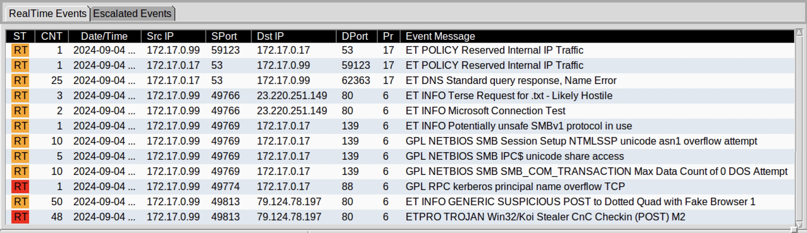

# PCAPEXPRESS Wireshark Series
## Exercise 03: Big Fish In a Little Pond
### Briefing:
**Platform:** malware-traffic-analysis[.]net 
**Pcap File:** 2024-09-04-traffic-analysis-exercise.pcap 

Indicators suggest a host within the network environment has been infected with malware. This analysis covers the investigation of the provided packet capture and associated alert logs.

### TASK:
<pre data-label="TASK" style="--delay: 0s;"><code>
01.Discover host details - [x] 02.Investigate breach - [x] 03.Write consise report - [x]
</code></pre>
### Tools:
<pre data-label="TASK" style="--delay: 0.7s;"><code>
<strong>* Wireshark</strong> – pcap inspection         <strong>* VirusTotal</strong> – malicious IPs and File inspection
<strong>* CyberChef</strong> – decoding packet data    <strong>* md5sum</strong> – calculating file hashes
</code></pre>

## 00: Prologue
This is the third exercise in the series. The initial investigation began with a review of the alert logs. 
Again it is very helpful and time saving to be able to direct ones attention to the source, and have a time line 
of events happening on the wire. Let us dive in!

<small>'00.Alerts.png'</small>

## 01: Host Discovery

I'm beginning with the affected hosts detail gathering. 
First is checking for the **DHCP** Request. 

.png)

<small>‘01a.DHCP Request.png’</small>

We have that traffic. We look in to the packet details.

.png)

<small>‘01b.DHCP Request Details.png’</small>

Moving on to Kerberos to check for a **user name**.

.png)

<small>‘01c.Kerberos Cname.png’</small>

We can further check the **LDAP** for **CN=Users** to get a full user name. 

.png)

<small>‘01d.LDAP CN=Users.png’</small>

The gathered results are below. With the Host Discovery out of the way 
Next we turn to the network traffic keeping the provided alert list in mind. 

**IP Address:** 172.17.0.99 
**MAC address:** Intel_b6:8d:c4 (18:3d:a2:b6:8d:c4) 
**Host Name:** DESKTOP-RNV09AT 
**Client name:** andrewfletcher 
**User Name:** Andrew Fletcher 

## 02: Examining Traffic

**Alert:** ET INFO GENERIC SUSPICIOUS POST to Dotted Quad with Fake Browser

This one is straight forward, we see a POST request that is directed to an IP address rather than a host. 

.png)

<small>‘10a.Suspicious POST.png’</small>

**Alert:** ETPRO TROJAN Win32/Koi Stealer CnC Checkin (POST) M2

We can see the numerous **POST** requests being sent out 1 minute apart. 
This is an indicator of **C2** beacon traffic. 
However all of the /foots.php are sent out with 0 bytes 
witch would mean no data has been sent out, **command** or **exfiltration** wise. 

.png)

<small>‘11a.CnC Trafic.png’</small>

## 03: Examining Objects/Domains

One object of interest has been discovered along with a couple of suspicious domains, 
lets check VirusTOtal for some details. 

<pre data-label="OBJECTS"><code>
01.File Name: sd4.ps1
MD5 Hash: 3e86c8009a224924049a5279b9d21786
VirusTotal Result: Malicious
Poplar threat label: trojan.koistealer/psinj
BitDefender: Trojan.Generic.37535674
</code></pre>

**02.IP:** 79[.]124[.]78[.]197 
**Domain:** n/a 
**VirusTotal Result:** 2 detected files communicating with this IP address 
**Comment:** I have checked the suspicious files associated with this particular address 
and the first one mentioned is a power shell file called **“sd4.ps1”**, checking the details of the 
file we see it is indeed a malicious file that is labeled as **"koistealer trojan"**. 
 
**03.I.P:** 46[.]254[.]34[.]201 
**Domain:** www[.]bellantonicioccolato[.]it 
**VirusTotal Result:** At least 10 detected files communicating with this domain 
**Comment:** This domain is a accessed close to our malicious POST traffic. The ViruTotal comment 
section has a mention of a KOI distribution domain. I have also checked the TCP stream, 
it is encrypted but we know that a total of 228kb of data has been exchanged 
with 221kb coming from the malicious domain. 
 

## 04. Short Report and Conclusion

In this particular exercise the pcap file did not feature the initial infection process. 
we have observed the post infection but not the full payload deployment/developement. 
We have detected traffic indicating our compromised host 
**(DESKTOP-RNV09AT)** communicating with a suspicious domain **(www[.]bellantonicioccolato[.]it)**. 
After a short moment we have observed the host sending **POST** requests to a malicious IP address 
indicating system compromise and the malware sending a beacon 
to the adversarial command and control server 79[.]124[.]78[.]197.
The virus activity has been picket up by the IDS and triggered an alert - “**Win32/Koi Stealer CnC Checkin (POST)**” 
Upon investigating the malicious domains with VirusTottal we have found evidence that they are in fact associated with the KOIstealer Trojan. 
Based on the length of the supplied pcap file we did not see any evidence of data exfiltration. 
The affected machine is to be reimaged/reinstalled and the malicious IPs and file hash to be added to the company's IDS system.

### TIME TO SWITCH GEARS

This concludes the **PCAP** series, however we are not done with **Wireshark**, 
I shall be using in througght the entire portfolio. 
I now invite you to check out the Purple Team exercises! 
[TECH BUREAU SERIES: main hub ](./TECH-BUREAU-main.md) 
*Spinning up a Wazuh agent and guarding a server, hope no one tries to steal the corporate secretes.*

  
  ⦿
  

[2.3]

