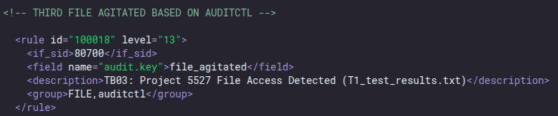
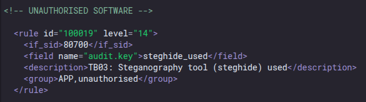

# TECH-BUREAU SERIES: PHASE 03
## CVE exploitation, privilege escalation and protocol tunneling.
### WHATS SHOWCASED
<section>
  <ul class="hover-card"> 
    <li>
      <strong>OFFENSE:</strong> Leveraging a system misscofiguration, priviledge escalating using an administrative oversight, Stealthy Data exfiltration 
    </li>
  </ul>
  <ul class="hover-card"> 
    <li>
      <strong>DEFENSE:</strong> Being more cautious and restrictive with the server. 
    </li> 
  </ul>
</section>

### The initial Setup
...

# AT4K-3XPR3S rolling out.
...

<pre data-label="auditctl" style="--delay: 0s;">
  <code>
<strong>root@TECH-BUREAU-UBUNTU-24:</strong>/home/lead_engineer# auditctl -l
-w /home/lead_engineer/PROJECT.5527/Frame_specs.txt -p rwa -k file_agitated
  </code></pre>

## 01.WAZUH ALERTS

<small>“01.wazuh-alerts.png”<small>

## 02.WAZUH OUTBOUND TRAFFIC

<small>“02.wazuh-4433-out.png”<small>

## 03.WAZUH OUTBOUND TRAFFIC 4433

<small>“03.wazuh-cat.png”<small>

## 04.WAZUH PACKAGE INSTALLED

<small>“04.wazuh-package-installed.png”<small>

## 05.WAZUH PACKAGE INSTALLED

<small>“05.wazuh-steghide-used.png”<small>

## 06.WAZUH OUTBOUND TRAFFIC 4040

<small>“06.wazuh-4040-out.png”<small>

## 07.WAZUH CURL

<small>“07.wazuh-CURL.png”<small>

## 08.WAZUH FILE DELETED

<small>“08.wazuh-delete.png”<small>

## 09.WIRESHARK SHELL TRAFFIC

<small>“09.wireshark-shell-traffic.png”<small>

## 10.WIRESHARK SHELL STREAM

<small>“10.wireshark-shell-stream.png”<small>

## 11.WIRESHARK POST TRAFFIC

<small>“11.wireshark-post-traffic.png”<small>

## 12.WIRESHARK POST STREAM

<small>“12.wireshark-post-stream.png”<small>

## 13.RULE OUTBOUD TRAFFIC

<small>“13.rule-outbound-traffic.png”<small>

## 14.RULE FILE OPENED

<small>“14.rule-file-opened.png”<small>

## 15.RULE STEGHIDE USED

<small>“15.rule-steghide-used.png”<small>

## 16.RULE CURL USED

<small>“16.rule-curl-used.png”<small>

## 17.GHEX CARVING

<small>“17.ghex-carving.png”<small>

## 18.RECONSTRUCTED IMAGE

<small>“T1:Casing.jpg”<small>

## 19.REVERSE STEGONOGRAPHY?

<small>“18.pcap-image-steghide.png”<small>

## LESSONS LEARNED
As the attacker: 
*  
*  
*  
As the defender: 
*  
*  
* . 
 
Continue?
 
[**TECH-BUREAU-SERIES: PHASE 03.** ](./TECH-BUREAU-PHASE-03.md)  
*Phish, infect, persist, escalate, obfuscate and extract. The system has been hardened to the fullest. 
A phishing campaign  is now in the cards, but how can we extract the data this time to dupe the TECH-BUREAU? 
**STAY TUNED TO FIND OUT!***

  
  ⦿
  

[3.2]

