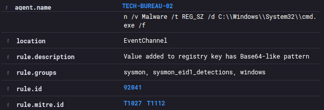
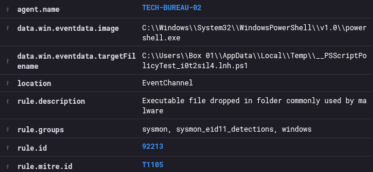
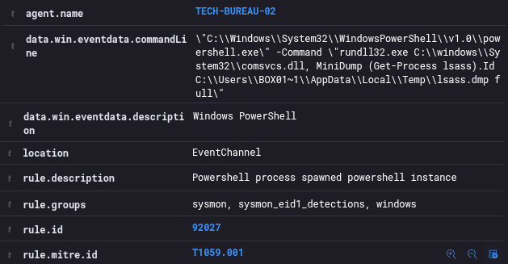

# TECH-BUREAU-SUPLIMENT
## THE SAGA OF SYSMON
### WHATS SHOWCASED:
<section>
  <ul class="hover-card"> 
    <li>
      <strong>DEFFENSE:</strong> The essential steps to kickstart the Sysmon logs
    </li>
  </ul>
</section>

### The Goal

This particular assignment was a challenge indeed, had had multiple issues with the alert sensitivity and the Sysmon config file, tried also rules from SOC Fortress but failed to configure the agent correctly and got a meriad of errors that became a nightmare to untangle… So I started from scratch and settled for a basic setup of using SwiftOnSecurity as the config file and just the inbuilt Wazuh Sysmon rules. The goal was to simply have the logs recording and funneling to the Wazuh manager and we even got some neat alerts out of it. So lets have a closer look.

## THE SETUP

<small>“Agent-active.png”<small>

We have a TECH-BUREAU Windows Box botted up and connected to our Wazuh manager. 

## Sysmon-running.png

<small>“Sysmon-running.png”<small>

Sysmon is installed and running, the fltmc command confirms that the file monitoring is active.
However the next 2 steps are what make it all work.

## Wazuh-ossec.png

<small>“Wazuh-ossec.png”<small>

We need to configure teh ossec file on the AGENT in our case thats the Windows VM. 
We can simply use the notepad to add the following bit of xml code.

<pre data-label="ossec.conf" style="--delay: 0s;"><code>
&lt;localfile&gt;
  &lt;location&gt;<strong>Microsoft-Windows-Sysmon/Operational</strong>&lt;/location&gt;
  &lt;log_format&gt;<strong>eventchannel</strong>&lt;/log_format&gt;
&lt;/localfile&gt;  
</code></pre>

The /Operational directory is where we want to pull our Sysmon generated logs. 
The eventchannel is what will be taking the logs in to Wazuh and interpreting them in JSON format 
Very digestible and doesnt requier a bespoke decoder to work. 

And finaly we want to give Sysmon a configuration file to focus on what to log and what to ignore, 
SwiftOnSecurity is the one that comes higlhy recomended so we shall use that one. 
After downloading the file we rename it to sysmonconfig.xml and run a simple command. 

<pre data-label="SwiftOnSecurityf" style="--delay: 0.7s;"><code>
<strong>./sysmon64.exe -i sysmonconfig.xml</strong>

Copyright (C) 2014-2021 Mark Russinovich and Thomas Garnier
Sysinternals - www.sysinternals.com

Configuration file <strong>validated.</strong>
Configuration <strong>updated.</strong>
</code></pre>

That is it realy. Now we have in depth Windows process monitoring capabilities. 
We shall run a series of simple powershell commands to check our setup. 

## Alert-01.png

<small>“Alert-01.png”<small>

4433

## Alert-02.png

<small>“Alert-02.png”<small>

4433

## Alert-03.png

<small>“Alert-03.png”<small>

4433

## Alert-04.png

<small>“Alert-04.png”<small>

4433

## Alert-05.png

<small>“Alert-05.png”<small>

4433

## Alert-06.png

<small>“Alert-06.png”<small>

4433

## Alert-07.png

<small>“Alert-07.png”<small>

4433

## Alert-08.png

<small>“Alert-08.png”<small>

4433

We see loads of traffic going to port 4433, we want to see the stream immediately. 

## LESSONS LEARNED

* Deeper understanding of the Wazuh structure 
* Sysmon config files can be notoriously noise or restrictive 
* Sometimes a prudent man deletes all the progress and starts from step one 
 
This concludes the TECH-BUREAU series, up next 
lets take a look at some cheeky malware shall we? 
[MALWARE-BOILER Series: main hub ](./MALWARE-BOILER-main.md)  
*Making a few Trojans and acting rather impish!*

  
  ⦿
  

[3.4]

