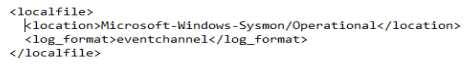

# TECH-BUREAU-SUPLIMENT: THE SAGA OF SYSMON.
## THE SYSMON WAZUH CONNECTION
### WHATS SHOWCASED:
<section>
  <ul class="hover-card"> 
    <li>
      <strong>DEFFENSE:</strong> The essential steps to kickstart the Sysmon logs
    </li>
  </ul>
 

### The initial Setup
In this scenario our **lead_engineer** has downloaded a tool from a compromised website. 
The tool is a python script that acts as a Trojan. Contains a legitimate math calculation function 
and in the background unbeknownst to the host it establishes a shell with the adversarial box. 

<pre data-label="..." style="--delay: 0.5s;"><code>
<strong>...</strong>
</code></pre>

# ALERT CHECK

## Agent-active.png

<small>“Agent-active.png”<small>

## Wazuh-ossec.png

<small>“Wazuh-ossec.png”<small>

## Eventchannel.png

<small>“Eventchannel.png”<small>

## Sysmon-running.png

<small>“Sysmon-running.png”<small>

## Alert-01.png

<small>“Alert-01.png”<small>

## Alert-02.png

<small>“Alert-02.png”<small>

## Alert-03.png

<small>“Alert-03.png”<small>

## Alert-04.png

<small>“Alert-04.png”<small>

## Alert-05.png

<small>“Alert-05.png”<small>

## Alert-06.png

<small>“Alert-06.png”<small>

## Alert-07.png

<small>“Alert-07.png”<small>

## Alert-08.png

<small>“Alert-08.png”<small>

We see loads of traffic going to port 4433, we want to see the stream immediately. 

## LESSONS LEARNED

* Deeper understanding of the Wazuh structure 
* Sysmon config files can be notoriously noise or restrictive 
* Sometimes a prudent man deletes all the progress and starts from step one 
 
This concludes the TECH-BUREAU series, up next 
lets take a look at some cheeky malware shall we? 
[MALWARE-BOILER Series: main hub ](./MALWARE-BOILER-main.md)  
*Making a few Trojans and acting rather impish!*

  
  ⦿
  

[3.4]

