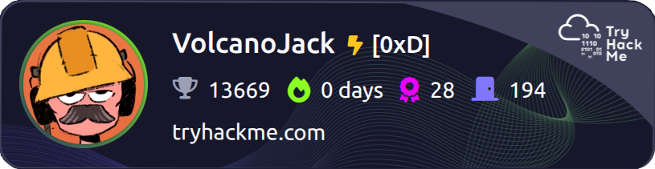

# CAR ATTENDENT ANDERSON PRESENTS
## A BOLD VOYAGE TOWARDS A TENGIBLE GOAL

### About the Author

  Here wrights to you a gentelman and a scholar. A former Beer Brewing proffesional of 10ish years that decided to hang up his old brewing cap and switch the phisical labour to something that is more mentaly stimulating. Enter a new drive for the IT security sector. The goal is to become a fully fledged SOC analyst with the ability to specialize when neccesary in network trafic analisys and malware reverse engineering. Curently residing on an island just of the coast of Croatia I have picked up kayaking and have been training hard. As a result I am a certified trip leader and instructor, the achivement im proud of the most is learning the C to C roll. 

CAREER GOALS
<section>
  <ul class="hover-card"> <li><strong>Early Days:</strong> Building competence within a SOC team.</li>
  </ul>
  <ul class="hover-card"> <li><strong>Mid Term:</strong> Graduating to SOC level 2. Dable in junior pentest projects.</li>
  </ul>
  <ul class="hover-card"> <li><strong>Long Term:</strong> Branching out in to Malware analisys and reverse engineering.</li>
  </ul>
</section>

Maybe details and why.

## CERTIFICATES

  
  

  

  

  
     

### 01.CompTIA Security+ ce Certification
Issuing Organization: *CompTIA* | Credential ID: <strong>90500d48-7815-4dc7-aba6-35b66f175898</strong> 
Issuing Date: 11/30/2024 |Expiration Date: 11/30/2027 

### 02.Google Cybersecurity Professional Certificate V2
Issuing Organization: *Coursera* | Credential ID: <strong>360c51c7-60ce-43c7-814f-498ce9ab6ca8</strong> 
Issuing Date: 10/23/2024 | Expiration Date: This credential does not expire 

### 03.Google AI Essentials V1
Issuing Organization: *Coursera* | Credential ID: <strong>f27aaa9a-7158-4b08-b329-6f8ebec7555c</strong> 
Issuing Date: 10/23/2024 | Expiration Date: This credential does not expire 

### 04.Level 2: Essentials of Kayak Touring (instructor)
Issuing Organization: *American Canoe Association* | ACA Number: <strong>80614605</strong> Issuing Date: 11/07/2025 
Issuing Date: 11/07/2025 | Expiration Date: 12/31/2029
 
Visit the Credly.com page to verify - <a href="https://www.credly.com/users/andrejs-petrovs.f33bc783" target="_blank" rel="noopener noreferrer">
  www.credly.com/users/andrejs-petrovs
</a>

### 05.TryHackMe

**Rank:** <strong>14/21 0xD [Legend] ≥ 20,000 points</strong> 
I have started my cyber journey with ***TryHackMe*** and what a ride it has been. 
Over the last couple of years I have been gravitating towards different paths. 
At the moment my progress is on hold, I am relying on labs of my own direction for the time being. 
However looking at my path progress Im just itching to get back and button up some of them, 
I mean look how close i am to the Pentest+. 
**P.S.** *don't ask me why I prioritized red teaming of the bat*. 

### Learning Paths Completion Tracker 

<pre data-label="THM PATHS"><code>
<strong>Pre Security</strong>          100% [===================>]  <strong>Cyber Security 101</strong> 67% [=============>------] 
<strong>Web Fundamentals</strong>       87% [=================>--]  <strong>SOC Level 1</strong>        42% [========>-----------] 
<strong>Jr Penetration Tester</strong> 100% [===================>]  <strong>CompTia Pentest+</strong>   91% [=================>--] 
</code></pre>

### TICKER TIME

<pre class="ticker-container" data-label="SYS_STATUS">
  <code class="ticker-content">
    REACTOR: ONLINE | SCANNER: ONLINE | CAFFEINE: 1 UNITS |REACTOR: ONLINE | SCANNER: ONLINE | CAFFEINE: 2 UNITS |REACTOR: ONLINE | SCANNER: ONLINE | CAFFEINE: 3 UNITS | ... |&nbsp;
    REACTOR: ONLINE | SCANNER: ONLINE | CAFFEINE: 1 UNITS |REACTOR: ONLINE | SCANNER: ONLINE | CAFFEINE: 2 UNITS |REACTOR: ONLINE | SCANNER: ONLINE | CAFFEINE: 3 UNITS | ... |&nbsp;
  </code>
</pre>

  
  ⦿
  

[5]

